# Proyecto de Simulación ATM — Banco de la Nación, Sede Central Puno

## Portada técnica

**Asignatura:** Modelado Sistémico y Simulación  
**Carrera:** Ingeniería de Sistemas  
**Caso de estudio:** Simulación del sistema de atención de cajeros automáticos (ATM) del Banco de la Nación, sede central de Puno  
**Documento:** Especificación refinada, criterios metodológicos, estructura de datos y preparación para simulación  
**Versión:** 1.0  
**Estado:** Fase documental cerrada / pre-modelado computacional  

---

## Índice

1. Propósito del proyecto
2. Alcance del modelo
3. Restricciones reales del levantamiento de datos
4. Contexto real 2026 usado para refinar el modelo
5. Criterios metodológicos clave
6. Supuestos defendibles del proyecto
7. Clasificación recomendada de usuarios por edad
8. Clasificación recomendada por sexo/género percibido
9. Reglas de inferencia del tipo de operación
10. Unidad analítica recomendada
10.1 Frontera del sistema real observado: BN sede central Puno
10.2 Reglas operativas reales del proceso ATM en BN Puno
10.3 Política de disponibilidad operativa del ATM
11. Diseño de datos recomendado
12. Variables refinadas del proyecto
13. Variables derivadas obligatorias
13.1 Unidad temporal base y criterio de medición
14. KPIs de salida mínimos
15. Metodología de levantamiento de datos recomendada
16. Ejemplos realistas, políticas operativas y preparación pre-simulación
16.12 Modelo de simulación de eventos discretos del sistema ATM
16.12.9 Resumen estadístico del dataset sintético-realista de referencia
17. Diagramas incorporados en la documentación
18. Cierre de la fase documental
Anexo A. Matriz de trazabilidad epistemológica
Anexo B. Diccionario formal de datos
Anexo C. Taxonomía exacta de peak flags y calendario operativo
Anexo D. Diagramas del sistema en PlantUML

---

# Especificación Refinada del Proyecto de Simulación ATM

## 1. Propósito del proyecto

Este proyecto busca modelar de forma realista el comportamiento de un sistema de cajeros automáticos (ATM) en la ciudad de Puno, Perú, con foco en:

- llegadas de usuarios
- formación y evolución de colas
- tiempos de servicio
- utilización de cajeros
- abandono de cola
- fallas técnicas y falta de efectivo
- saturación en horas pico
- impacto operativo de mantenimiento e interrupciones

El objetivo no es solamente animar el sistema, sino producir evidencia cuantitativa para la toma de decisiones.

---

## 2. Alcance del modelo

El documento base menciona una notación tipo **M/M/4**, pero el problema real excede un modelo analítico puro porque incluye:

- abandono de cola
- fallas técnicas
- indisponibilidad por mantenimiento o recarga
- variación por franja horaria
- restricciones de disponibilidad de efectivo
- diferencias por perfil de usuario
- tipo de operación no observado directamente

Por lo tanto:

- **Modelo teórico base**: M/M/4
- **Modelo recomendado de implementación**: simulación de eventos discretos en SimPy

### 2.1 Clasificación formal del modelo

Desde una perspectiva de modelado sistémico y simulación, este caso puede clasificarse como:

- **sistema dinámico**: cambia en el tiempo
- **sistema estocástico**: su evolución depende de variables aleatorias o inciertas
- **sistema discreto en eventos**: los cambios de estado ocurren cuando suceden eventos relevantes
- **sistema abierto**: recibe entradas del entorno y está afectado por variables exógenas
- **sistema de colas multiservidor**: varios ATM atienden una demanda compartida
- **sistema socio-técnico**: combina comportamiento humano, reglas operativas y recursos físicos

### 2.2 Tipo de modelos aplicables

#### a) Modelo conceptual del sistema
Es el modelo que describe:

- actores
- recursos
- reglas de cola
- estados del ATM
- eventos relevantes
- límites del sistema

Este modelo es obligatorio antes de hablar de fórmulas o distribuciones.

#### b) Modelo analítico de referencia
Como aproximación inicial de teoría de colas, el caso puede compararse con:

- **M/M/4**, si se asume:
  - llegadas Poisson
  - servicio exponencial
  - 4 servidores
- **M/G/4**, si se mantiene llegada Poisson pero el tiempo de servicio no es exponencial

#### c) Modelo operativo principal
El modelo principal recomendado para este proyecto es una:

- **simulación de eventos discretos**

porque el sistema real incorpora:

- cola preferencial ocasional
- ayuda del personal
- abandono
- mantenimiento
- cashout
- recarga no programada públicamente
- restricciones horarias
- variación por calendario de pagos

### 2.3 Juicio crítico sobre Poisson y otras distribuciones

#### Lo defendible
Es perfectamente razonable usar como hipótesis de trabajo inicial:

- **proceso de Poisson** para llegadas
- **distribución exponencial** para tiempos entre llegadas

siempre que se aclare que se trata de una aproximación inicial y no de una verdad ya probada en el punto observado.

#### Lo no defendible
No sería serio imponer desde el inicio un M/M/4 rígido como representación final del sistema, porque el caso real del BN Puno incluye contingencias y reglas operativas que rompen la pureza del supuesto clásico.

### 2.4 Posición metodológica recomendada

La posición profesional correcta para este trabajo es:

- usar **M/M/4 o M/G/4** como referencia teórica de base
- construir la representación principal mediante **simulación de eventos discretos**
- calibrar progresivamente el comportamiento del sistema con evidencia observada y supuestos documentados

### 2.5 Papel de los números pseudoaleatorios en la simulación

La futura implementación computacional del modelo no trabajará con azar físico, sino con **números pseudoaleatorios** generados por computadora. En simulación, esto es completamente normal y metodológicamente correcto, siempre que se documente con claridad.

Los números pseudoaleatorios permiten muestrear distribuciones de probabilidad para representar comportamientos inciertos del sistema. En este proyecto, su función sería generar o activar, según corresponda:

- tiempos entre llegadas de clientes
- duraciones de servicio
- ocurrencia de abandono cuando se adopte una formulación probabilística
- ocurrencia de fallas técnicas
- ocurrencia de eventos de `cashout`
- duración de indisponibilidades por falla, mantenimiento o recarga
- activación de eventos exógenos como restricciones o cambios operativos

### 2.5.1 Rol metodológico del pseudoazar

El objetivo del pseudoazar en esta simulación NO es “inventar caos”, sino reproducir de forma controlada la variabilidad observable del sistema real. Esto permite:

- representar heterogeneidad entre clientes
- representar variación temporal entre llegadas
- reproducir interrupciones no determinísticas
- construir escenarios repetibles con semilla fija
- comparar políticas o configuraciones bajo múltiples corridas

En este proyecto, la pseudoaleatoriedad no debe operar con una única tasa fija durante toda la jornada. Debe responder a la estructura temporal del sistema, de modo que la intensidad de llegadas pueda variar según la franja del día, la presión de calendario y las contingencias activas.

### 2.5.2 Reproducibilidad mediante semilla

Toda implementación seria debe permitir fijar una **semilla** (`seed`) del generador pseudoaleatorio. Con ello:

- una misma corrida puede repetirse
- los resultados pueden auditarse
- distintos escenarios pueden compararse con mayor control experimental

En otras palabras, la pseudoaleatoriedad no debilita el trabajo; lo vuelve experimentalmente reproducible.

### 2.6 Modelos probabilísticos y estadísticos de referencia

El proyecto ya reconoce a **M/M/4** y **M/G/4** como referencias teóricas, pero conviene explicitar con mayor claridad qué representa cada componente y cómo se conecta con la simulación.

### 2.6.1 Proceso de Poisson para llegadas

Cuando se afirma que las llegadas pueden modelarse inicialmente con un **proceso de Poisson**, se está diciendo que el número de llegadas en un intervalo de tiempo puede representarse como:

\[
P(N(t)=k)=\frac{(\lambda t)^k e^{-\lambda t}}{k!}, \quad k=0,1,2,\dots
\]

donde:

- \(N(t)\) = número de llegadas en el intervalo \(t\)
- \(\lambda\) = tasa media de llegadas por unidad de tiempo

En este contexto, \(\lambda\) no debe considerarse como constante universal del sistema, sino como una tasa que puede variar según:

- franja horaria
- calendario laboral
- presión social parcial
- contingencias operativas

### 2.6.2 Distribución exponencial para interarribos

Si las llegadas siguen un proceso de Poisson homogéneo por tramo, entonces el tiempo entre llegadas puede modelarse con distribución exponencial:

\[
f_T(t)=\lambda e^{-\lambda t}, \quad t \ge 0
\]

y su función de distribución acumulada es:

\[
F_T(t)=1-e^{-\lambda t}
\]

Esto significa que:

- intervalos cortos entre llegadas son más frecuentes
- intervalos largos son menos frecuentes
- la media esperada del interarribo es:

\[
E[T]=\frac{1}{\lambda}
\]

### 2.6.3 M/M/4 como referencia analítica

La notación **M/M/4** significa:

- primera **M**: llegadas Markovianas / Poisson
- segunda **M**: servicio Markoviano / exponencial
- **4**: cuatro servidores paralelos

Como referencia teórica, este modelo es útil porque permite pensar el sistema como una cola multiservidor y usar indicadores clásicos como:

- tasa de utilización
- tiempo medio de espera
- longitud media de cola

Sin embargo, este modelo solo es una aproximación base. No describe adecuadamente por sí solo fenómenos como:

- abandono
- ayuda asistida
- fallas
- `cashout`
- mantenimiento
- restricciones horarias
- variación por calendario de pagos

### 2.6.4 M/G/4 como referencia más flexible

La notación **M/G/4** mantiene:

- llegadas Poisson
- cuatro servidores

pero reemplaza el supuesto de servicio exponencial por una distribución más general (**G** = general). Esto es útil cuando la duración del servicio visible:

- no es memoryless
- presenta asimetría
- depende de fricción del usuario
- cambia por ayuda asistida o interrupciones

En términos metodológicos, **M/G/4** es una referencia más realista que **M/M/4** cuando los tiempos de servicio no se ajustan bien a una exponencial simple.

### 2.6.5 Otras distribuciones plausibles por fenómeno

Además de Poisson y exponencial, el proyecto puede requerir distribuciones distintas según el fenómeno representado.

#### a) Tiempos de servicio
Si no se mantiene el supuesto exponencial, podrían considerarse distribuciones como:

- **triangular**, cuando solo se cuente con mínimo, valor más probable y máximo
- **lognormal**, cuando existan colas derechas por demoras excepcionales
- **gamma**, cuando se quiera representar duración positiva con asimetría moderada

#### b) Abandono
El abandono puede tratarse como:

- umbral determinístico
- variable Bernoulli condicionada a espera/contexto
- probabilidad creciente con la cola o la demora

Una formulación Bernoulli básica sería:

\[
P(A=1)=p
\]

donde \(A=1\) representa abandono y \(p\) depende del contexto operativo.

#### c) Fallas y cashout
La ocurrencia de fallas o `cashout` puede modelarse inicialmente como:

- eventos de Bernoulli por intervalo
- procesos de Poisson raros por franja o escenario

y la duración de la indisponibilidad puede representarse con distribuciones positivas como:

- exponencial
- gamma
- triangular

según el nivel de evidencia disponible.

#### d) Eventos exógenos
Cambios por calendario, presión social o restricción horaria pueden modelarse como:

- modificadores determinísticos de tasa
- activadores binarios de contexto
- eventos calendarizados con ventanas probabilísticas

### 2.6.6 Generación pseudoaleatoria a partir de distribuciones

Cuando se implementa una distribución en simulación, lo que realmente hace el programa es transformar números pseudoaleatorios en muestras de esa distribución.

Por ejemplo, si \(U \sim Uniforme(0,1)\), una forma clásica de obtener un interarribo exponencial es:

\[
T=-\frac{1}{\lambda}\ln(1-U)
\]

Esta idea es importante porque conecta:

- teoría de probabilidad
- generación computacional
- representación de comportamiento realista en SimPy

### 2.6.7 Regla metodológica final sobre modelos probabilísticos

Ni Poisson, ni exponencial, ni cualquier otra distribución deben presentarse como verdades cerradas del sistema real sin contraste posterior. Su rol correcto en esta fase es:

- servir como hipótesis iniciales defendibles
- permitir una primera formalización del modelo
- dar base matemática a la simulación
- quedar sujetas a calibración y ajuste empírico

En resumen:

- **Poisson/exponencial** = punto de partida defendible
- **M/M/4** = referencia teórica simple
- **M/G/4** = referencia más flexible para servicio
- **simulación de eventos discretos** = representación principal recomendada del sistema ATM real

### 2.6.8 Glosario mínimo de símbolos matemáticos y probabilísticos

Para evitar ambigüedad en la lectura de fórmulas, se adopta el siguiente glosario mínimo:

- \(N(t)\): número de llegadas observadas o modeladas en un intervalo de longitud \(t\)
- \(t\): longitud del intervalo temporal o instante de tiempo, según contexto
- \(k\): número entero de eventos/llegadas en un intervalo
- \(\lambda\): tasa media de llegadas por unidad de tiempo
- \(T\): variable aleatoria de tiempo entre llegadas
- \(f_T(t)\): función de densidad del tiempo entre llegadas
- \(F_T(t)\): función de distribución acumulada del tiempo entre llegadas
- \(E[T]\): valor esperado o media del tiempo entre llegadas
- \(U\): variable aleatoria uniforme en el intervalo \((0,1)\)
- \(A\): variable aleatoria indicadora de abandono
- \(p\): probabilidad de abandono en una formulación Bernoulli básica
- \(c\): número de servidores; en este proyecto, \(c=4\)
- \(\mu\): tasa media de servicio por servidor cuando se use formulación exponencial para servicio
- \(\rho\): utilización o intensidad de tráfico del sistema
- \(W_q\): tiempo promedio de espera en cola
- \(L_q\): longitud promedio de cola

### 2.6.9 Fórmulas básicas de referencia para métricas del sistema

En la fase analítica y de simulación, conviene mantener explícitas algunas relaciones básicas.

#### a) Utilización aproximada del sistema

Como referencia general de teoría de colas:

\[
\rho = \frac{\lambda}{c\mu}
\]

donde:

- \(\lambda\) = tasa media de llegadas
- \(\mu\) = tasa media de servicio por servidor
- \(c\) = número de servidores

Para el caso ATM documentado, cuando se use una aproximación analítica simple:

\[
\rho = \frac{\lambda}{4\mu}
\]

Esta expresión es útil como indicador de carga aproximada, pero no reemplaza la simulación cuando existen fallas, abandono, cashout, ayuda asistida o capacidad variable.

#### b) Tiempo medio de espera en cola

En el marco del proyecto, \(W_q\) se estimará principalmente por simulación como:

\[
W_q = \frac{1}{n}\sum_{i=1}^{n} waiting\_time_i
\]

donde:

- \(n\) = número de clientes observados o simulados en el cálculo
- \(waiting\_time_i\) = tiempo de espera en cola del cliente \(i\)

#### c) Longitud media de cola

La longitud promedio de cola, \(L_q\), puede estimarse en simulación mediante promedio temporal de snapshots:

\[
L_q \approx \frac{1}{m}\sum_{j=1}^{m} queue\_length_j
\]

donde:

- \(m\) = número de snapshots considerados
- \(queue\_length_j\) = longitud de cola observada o simulada en el snapshot \(j\)

#### d) Tasa de pérdida o abandono

La tasa de pérdida puede expresarse como:

\[
loss\_rate = \frac{clientes\ perdidos}{llegadas\ totales}
\]

donde “clientes perdidos” incluye, según la definición operativa del proyecto:

- abandono de cola
- bloqueo por restricción horaria
- otros casos equivalentes documentados como pérdida del sistema

### 2.6.10 Relación entre modelos probabilísticos y parámetros del proyecto

La sección de parámetros del modelo debe interpretarse a la luz de esta base probabilística.

- la **tasa de llegada por franja** se vincula con \(\lambda\)
- la **distribución de interarribos** se vincula con el supuesto Poisson/exponencial inicial
- los **tiempos de servicio** pueden vincularse con \(\mu\) si se adopta servicio exponencial, o con una distribución general si se trabaja bajo lógica M/G/4
- el **abandono** puede formularse como umbral o probabilidad condicionada
- las **fallas**, el **cashout** y la **recarga** pueden modelarse con eventos discretos y distribuciones positivas para duración

Esto evita que las fórmulas queden aisladas del resto del documento.

---

## 3. Restricciones reales del levantamiento de datos

La observación fue realizada **desde el exterior del recinto ATM** por razones de seguridad. Eso impone límites metodológicos importantes:

- no se observa directamente la pantalla del cajero
- no se conoce el tipo real de operación
- no se conoce la edad real del usuario
- no se conoce el sexo/género real del usuario, solo su percepción visual externa
- no se conoce con certeza el estado interno del ATM

Por eso este proyecto DEBE diferenciar entre:

1. **dato observado**
2. **dato inferido**
3. **dato estimado/modelado**

Si no se hace esta separación, el trabajo pierde rigor.

---

## 4. Contexto real 2026 usado para refinar el modelo

### 4.1 Hechos públicos considerados

#### RENIEC 2026
- RENIEC reportó para las ERM 2026 un padrón de **26,353,329 electores**.
- La composición por sexo del padrón es prácticamente paritaria:
  - **50.22% mujeres**
  - **49.78% hombres**

#### INEI 2025/2026
- INEI reportó que la pobreza monetaria nacional 2025 fue **25.7%**.
- En **Puno**, la pobreza monetaria reportada fue **37.5%**, ubicándose entre las más altas del país.
- La brecha urbano-rural sigue siendo importante, lo que influye en acceso y uso de servicios financieros.

#### BCRP 2026
- El BCRP reporta fuerte crecimiento de pagos digitales en el Perú al 2025/2026.
- El indicador de pagos digitales por adulto/año sigue creciendo.
- También crecen pagos inmediatos y QR interoperable.

#### SBS 2026
- La SBS mantiene línea institucional fuerte sobre inclusión financiera y crecimiento del ecosistema digital.

### 4.2 Lectura de modelado a partir de esos hechos

El Perú de 2026 es un sistema **híbrido**:

- los pagos digitales crecen fuerte
- PERO el efectivo sigue siendo muy relevante
- y en regiones como Puno, por contexto socioeconómico, el uso de ATM para retiro de efectivo sigue siendo importante

Entonces, para esta simulación, NO sería serio asumir que el ATM es un canal residual. Tampoco sería serio asumir que todo sigue siendo 100% efectivo como hace diez años. La realidad está en el medio.

---

## 5. Criterios metodológicos clave

### 5.1 Qué sí puede observarse desde afuera

- hora de llegada
- hora de salida aproximada
- si entró a cola o no
- posición aproximada en cola al llegar
- si abandonó o no
- momento aproximado de abandono
- longitud visible de cola
- percepción visual del sexo/género
- estimación gruesa de rango etario

### 5.2 Qué no puede observarse directamente

- tipo real de operación
- monto retirado
- saldo consultado
- motivo real del abandono
- estado interno del ATM
- disponibilidad real de efectivo
- causa exacta de una falla

### 5.3 Regla de oro documental

Toda variable debe quedar marcada implícita o explícitamente como:

- **observada**
- **inferida**
- **estimada**

---

## 6. Supuestos defendibles del proyecto

### 6.1 Supuestos etarios

Dado el contexto peruano 2026 y el uso típico del ATM:

- el universo dominante de usuarios debe modelarse en **18 años o más**
- los menores de edad no deben ser el grupo principal
- para una simulación generalista en Puno, es razonable tratar a los adolescentes como **casos marginales o excepcionales**

### 6.2 Supuestos por sexo/género percibido

- es razonable asumir una distribución cercana a paridad en población adulta usuaria potencial
- no es serio afirmar una sobrerrepresentación fuerte de hombres o mujeres sin microdato local

### 6.3 Supuestos sobre operaciones ATM

En un contexto híbrido 2026, para ATM físico en Puno es defendible asumir esta jerarquía de operaciones probables:

1. **retiro**
2. **consulta**
3. **pago**
4. **transferencia**
5. **otros**

### 6.4 Supuestos sobre picos de demanda

Es razonable modelar picos probables en:

- mañana temprana
- mediodía
- fin de tarde
- quincena
- fin de mes
- días de pago o depósitos masivos

### 6.4.1 Ventanas pico operativas defendibles para el caso BN Puno

En ausencia de una serie oficial cerrada de afluencia horaria específica para la sede ATM observada, la definición de ventanas pico debe apoyarse en una inferencia operativa defendible. Para este caso, esa inferencia puede sustentarse en:

- dinámica del centro urbano
- jornada laboral y pausas de almuerzo
- necesidad de retiros en efectivo en horas de circulación alta
- salida parcial de trabajadores al mediodía
- salida laboral y cierre progresivo de actividades al final de la tarde
- presión adicional por calendario de pagos y programas sociales

Con ese criterio, las ventanas más defendibles para esta fase son:

| Ventana | Intensidad esperada | Fundamentación operativa |
|---|---|---|
| `08:00–09:59` | baja a media | inicio de actividades, retiros previos a trabajo o trámites |
| `10:30–11:29` | media creciente | aumento de circulación y trámites en el centro urbano |
| `11:30–13:59` | **pico principal** | salida parcial para almuerzo, concentración peatonal y retiros de efectivo en zona central |
| `14:00–15:59` | media-alta | continuidad de trámites y rezago del mediodía |
| `17:00–18:59` | **pico secundario** | salida laboral, cierre parcial de actividades y demanda de efectivo para movilidad o gasto cotidiano |
| `19:00 en adelante` | decreciente | reducción progresiva de actividad comercial y administrativa |

Estas ventanas deben tratarse como **hipótesis operativas fuertes** y no como verdad empírica cerrada. Su función es guiar el modelado inicial, la clasificación intradía y la futura calibración de tasas de llegada.

### 6.4.2 Relación entre ventanas pico y simulación estocástica

La futura simulación con números pseudoaleatorios debe respetar esta estructura temporal. Eso significa que la tasa de llegadas \(\lambda\) o sus modificadores no deberían mantenerse constantes a lo largo de toda la jornada, sino variar según:

- banda intradía
- calendario laboral
- presión social parcial
- reducción de capacidad operativa

En términos prácticos, el pseudoazar debe usarse para generar llegadas dentro de cada tramo, pero la intensidad base de ese tramo debe responder a la lógica operativa ya documentada.

### 6.4.3 Tabla maestra inicial de intensidad relativa de llegadas

Para evitar una simulación con tasa homogénea artificial durante toda la jornada, se propone una tabla inicial de intensidad relativa de llegadas por franja. Esta tabla no fija todavía valores definitivos de \(\lambda\), pero sí establece relaciones comparativas defendibles entre tramos.

| Franja | Banda intradía sugerida | Intensidad relativa de \(\lambda\) | Lectura operativa |
|---|---|---|---|
| `08:00–09:59` | `morning_transition` | baja–media | inicio de actividad con flujo útil pero aún contenido |
| `10:30–11:29` | `morning_transition` | media creciente | aumento de circulación y proximidad al mediodía |
| `11:30–13:59` | `midday_peak` | **alta / máxima** | ventana principal de presión por almuerzo, trámites y retiros |
| `14:00–15:59` | `afternoon_peak` | media–alta | rezago del mediodía y continuidad de trámites |
| `17:00–18:59` | `evening_peak` | alta secundaria | salida laboral y demanda de efectivo de fin de jornada |
| `19:00–21:59` | `night_low` o equivalente bajo | baja | caída progresiva de circulación |
| `22:00–05:00` | `night_low` | muy baja / restringida | presión residual con restricciones operativas |

### 6.4.4 Modificadores contextuales sobre la intensidad base

La intensidad relativa de llegadas por franja no debe operar sola. Debe modificarse, al menos documentalmente, por factores como:

- `payroll_cycle_type`
- `peak_social_transfer_flag`
- `peak_operational_type`
- `restricted_cash_window_flag`

En términos prácticos:

- una franja `midday_peak` en día normal no debe comportarse igual que una franja `midday_peak` en `fin_mes`
- una franja de intensidad alta con falla o `cashout` no solo cambia la cola: también cambia abandono y presión compuesta
- una franja nocturna restringida debe operar con intensidad baja, aunque exista demanda residual

### 6.5 Supuestos sobre dependencia del efectivo

Para Puno 2026, por condiciones de pobreza, heterogeneidad territorial y uso persistente del efectivo, es defendible asumir que:

- el retiro de efectivo sigue siendo operación dominante
- la migración digital reduce algunas consultas y pagos
- pero no elimina la presión sobre ATM físico

---

## 7. Clasificación recomendada de usuarios por edad

Como la edad exacta no puede conocerse visualmente, NO corresponde inventarla como verdad. Lo correcto es trabajar con rangos.

### 7.1 Rango etario recomendado

| Rango | Edad aproximada | Uso recomendado |
|---|---|---|
| `joven` | 18–29 | Sí |
| `adulto` | 30–59 | Sí |
| `adulto_mayor` | 60+ | Sí |
| `adolescente` | 15–17 | Solo marginal o excepcional |
| `no_determinado` | no inferible | Sí |

### 7.2 Regla práctica para este proyecto

Para ejemplos realistas y para la mayoría de registros simulados:

- priorizar `joven`, `adulto`, `adulto_mayor`
- evitar llenar artificialmente la muestra con `adolescente`

### 7.3 Segmentación operacional complementaria de adultos mayores

Para análisis con mayor detalle, puede subdividirse `adulto_mayor` en:

| Segmento | Rango aproximado | Uso metodológico |
|---|---|---|
| `adulto_mayor_joven` | `60–74` | representar menor fricción relativa y mayor heterogeneidad funcional |
| `adulto_mayor_mayor` | `75+` | representar mayor probabilidad de ayuda asistida, demora visible o abandono por fricción |

En esta fase, esta segmentación puede tratarse como refinamiento complementario y no como obligación de reestructurar de inmediato todos los registros existentes.

---

## 8. Clasificación recomendada por sexo/género percibido

Como la observación fue externa, esta variable NO representa identidad real, sino percepción visual operativa.

Valores recomendados:

- `masculino`
- `femenino`
- `no_determinado`

No corresponde usar esta variable para afirmaciones sociológicas fuertes. Solo sirve para segmentación descriptiva y exploratoria del flujo observado.

---

## 9. Reglas de inferencia del tipo de operación

El tipo de operación no fue visible directamente, así que debe tratarse como **inferido**.

### 9.1 Reglas orientativas

- permanencia muy corta: probable `consulta`
- permanencia corta a media: probable `retiro`
- permanencia media a alta: probable `pago` o `transferencia`
- comportamiento ambiguo: `otros`

### 9.2 Variables obligatorias para transparentar la inferencia

- `transaction_type`
- `transaction_type_inferred`
- `transaction_type_confidence`

### 9.3 Niveles sugeridos de confianza

- `alta`
- `media`
- `baja`

### 9.4 Tabla metodológica inicial de inferencia operativa

| Duración visible aproximada | Operación más probable | Operaciones alternativas plausibles | Confianza máxima permitida | Regla de uso |
|---|---|---|---|---|
| `30–90` segundos | `consulta` | `retiro` muy ágil | `media` | usar solo si no hubo cola visible significativa, ayuda asistida ni interrupción |
| `90–180` segundos | `retiro` | `consulta`, `pago` breve | `media` | es la banda más compatible con retiro típico, pero no debe marcarse como certeza automática |
| `180–300` segundos | `pago` o `transferencia` | `retiro` con fricción, `otros` | `baja` | si hubo señales de duda, ayuda o lentitud, evitar sobreinterpretar el tipo |
| `>300` segundos | `otros` o operación con fricción alta | `pago`, `transferencia`, `retiro` con contingencia | `baja` | tiempos altos visibles deben interpretarse con prudencia porque pueden reflejar fricción, no complejidad intrínseca |

### 9.5 Reglas obligatorias de degradación de confianza

La confianza inferida debe reducirse al menos un nivel cuando ocurra cualquiera de estas condiciones:

- presencia probable de ayuda asistida
- cola preferencial o intervención del personal
- interrupción por falla, cashout o mantenimiento
- comportamiento ambiguo del usuario frente al ATM
- lentitud visible del sistema
- pérdida parcial de visibilidad del evento

### 9.6 Regla de especialista

En observación externa de ATM, la categoría `alta` debe usarse de forma excepcional. Como regla operativa general para esta fase, lo más defendible es que la mayoría de inferencias se mantengan en `baja` o `media`.

---

## 10. Unidad analítica recomendada

El proyecto debe separar la información en tres capas operativas y una capa conceptual:

1. **evento de cliente**
2. **estado de ATM**
3. **estado agregado del sistema**
4. **supuestos/contexto del modelo**

---

## 10.1 Frontera del sistema real observado: BN sede central Puno

### Dentro del sistema

Se considera dentro del sistema observado y modelado:

- el área ATM de la sede central del Banco de la Nación en Puno
- los **4 cajeros automáticos** existentes en esa sede
- la cola general de acceso a ATM
- la cola preferencial cuando aplica
- los clientes que efectivamente llegan al área ATM
- las interacciones visibles de espera, abandono, atención y salida
- los cambios visibles o inferibles de disponibilidad del ATM

### Fuera del sistema

Se considera fuera del sistema directo:

- ventanillas de atención del banco
- operaciones internas del core bancario
- validación real de saldos y autorizaciones internas
- usuarios que deciden no acercarse al ver congestión desde lejos
- usuarios de Pensión 65 que cobran por agencia, ETV o domicilio fuera del área ATM observada
- horarios internos exactos de reposición de efectivo
- logística exacta del camión de transporte de valores

### Regla metodológica

Algo puede estar fuera del sistema y aun así afectar el sistema. Por ejemplo:

- pagos públicos
- Pensión 65
- recarga de efectivo
- mantenimiento

Eso significa que deben modelarse como **factores exógenos** o **eventos contextuales**, no como procesos visibles internos.

---

## 10.2 Reglas operativas reales del proceso ATM en BN Puno

Con base en el contexto aclarado por el usuario, este sistema debe modelarse así:

### Reglas de cola

- existen **4 ATM**
- existe **una sola cola general** para acceder al primer ATM funcional libre
- no existe un cajero preferencial exclusivo
- sí existe una **cola preferencial** para:
  - personas adultas mayores
  - personas con discapacidad
  - mujeres embarazadas

### Regla de prioridad

La cola preferencial existe, pero su frecuencia en el área ATM observada es baja en comparación con el flujo general. Muchos usuarios vulnerables tienden a usar:

- ventanilla
- otros canales de pago documentados

### Asignación de servidor

- el usuario toma el **primer ATM funcional libre**
- no se modela preferencia normal por ATM específico

### Intervención del personal

En algunos casos, personas adultas mayores o con dificultades funcionales pueden recibir ayuda del personal del banco.

Esa ayuda puede:

- aumentar el tiempo total de atención
- generar micro-demoras en la cola
- alterar la duración visible de la operación sin cambiar necesariamente el tipo de operación principal

---

## 10.3 Política de disponibilidad operativa del ATM

Los ATM del BN Puno pueden encontrarse en estos estados relevantes:

- disponible y libre
- disponible y ocupado
- fuera de servicio por falla
- en mantenimiento
- sin efectivo (`cashout`)
- reactivado luego de intervención

### Punto crítico confirmado por contexto real

Los cajeros:

- **a veces se quedan sin efectivo**
- **a veces entran en mantenimiento**

### Reposición de efectivo

La reposición existe como evento real del sistema, pero:

- su horario **no es fijo**
- su detalle exacto **no es público**
- el camión de transporte de valores puede llegar en horarios variables
- esa variabilidad responde a criterios de seguridad

### Juicio metodológico correcto

Por lo tanto, NO debe modelarse la reposición de efectivo como una hora exacta fija. Lo correcto es tratarla como:

- **evento exógeno estocástico o programado con ventana incierta**

Esto es muchísimo más realista que inventar una hora rígida.

---

## 11. Diseño de datos recomendado

Para un trabajo serio, NO conviene un solo CSV mezclando todas las granularidades.

Se recomienda usar estos archivos:

1. `customer_event_log.csv`
2. `atm_state_log.csv`
3. `system_snapshot_log.csv`

### 11.1 customer_event_log.csv
Registro por cliente o intento de atención.

### 11.2 atm_state_log.csv
Registro por cambio de estado operativo del ATM.

### 11.3 system_snapshot_log.csv
Registro agregado por instante o intervalo fijo.

---

## 12. Variables refinadas del proyecto

### 12.1 Variables de evento de cliente

| Variable | Tipo | Naturaleza | Descripción |
|---|---|---|---|
| `event_id` | string | observada | identificador único |
| `customer_id` | string | observada | identificador anonimizado |
| `branch_id` | string | observada | sede observada |
| `observation_date` | date | observada | fecha |
| `day_of_week` | categorical | derivada | día de semana |
| `day_type` | categorical | derivada | weekday, saturday, sunday_holiday |
| `hour_block` | string | derivada | bloque horario |
| `peak_flag` | boolean | inferida | si está en pico operativo |
| `arrival_ts` | datetime | observada | llegada al sistema |
| `service_start_ts` | datetime | inferida | inicio de atención |
| `service_end_ts` | datetime | inferida | fin de atención |
| `departure_ts` | datetime | observada/inferida | salida del sistema |
| `observed_sex` | categorical | observada visual | sexo/género percibido |
| `estimated_age_range` | categorical | inferida | rango etario estimado |
| `estimated_age_min` | integer | inferida | límite inferior |
| `estimated_age_max` | integer | inferida | límite superior |
| `transaction_type` | categorical | inferida | retiro, consulta, pago, transferencia, otros |
| `transaction_type_inferred` | boolean | inferida | marca de inferencia |
| `transaction_type_confidence` | categorical | inferida | baja, media, alta |
| `atm_id` | integer | inferida | ATM usado |
| `queue_entered` | boolean | observada | ingresó a cola |
| `queue_position_at_arrival` | integer | observada/inferida | posición al llegar |
| `abandoned` | boolean | observada | abandono |
| `abandon_ts` | datetime | observada/inferida | momento de abandono |
| `abandon_reason` | categorical | inferida | saturacion, espera_alta, falla_percibida, horario, otros |
| `served_flag` | boolean | inferida | si terminó siendo atendido |
| `blocked_by_closed_hours` | boolean | estimada/modelada | si la operación queda bloqueada por política horaria |
| `observation_mode` | categorical | observada | externa_visual |
| `data_quality_flag` | categorical | observada/metadato | observado, inferido, estimado, mixto |

#### Variables adicionales integrables al evento de cliente

- `assisted_service_flag`: marca si hubo indicio visible o supuesto fuerte de intervención del personal durante la atención
- `priority_queue_flag`: marca si el evento parece haber sido atendido bajo lógica de prioridad excepcional
- `adulto_mayor_segment`: refinamiento opcional de `estimated_age_range` cuando exista base razonable para distinguir `adulto_mayor_joven` y `adulto_mayor_mayor`

### 12.2 Variables de estado del ATM

| Variable | Tipo | Naturaleza | Descripción |
|---|---|---|---|
| `atm_state_event_id` | string | observada/modelada | identificador del evento de estado |
| `atm_id` | integer | observada/modelada | ATM |
| `state_start_ts` | datetime | observada/inferida | inicio de estado |
| `state_end_ts` | datetime | observada/inferida | fin de estado |
| `atm_state` | categorical | inferida/modelada | idle, busy, down_failure, down_maintenance, cashout, offline |
| `cash_available` | numeric | estimada/modelada | efectivo disponible |
| `failure_flag` | boolean | inferida/modelada | falla técnica |
| `failure_type` | categorical | estimada/modelada | red, hardware, software, falta_efectivo, otros |
| `maintenance_flag` | boolean | estimada/modelada | mantenimiento |
| `maintenance_type` | categorical | estimada/modelada | preventivo, correctivo, recarga_efectivo, reinicio |
| `network_outage_flag` | boolean | estimada/modelada | caída externa |
| `data_quality_flag` | categorical | metadato | observado, inferido, estimado |

### 12.3 Variables de estado del sistema

| Variable | Tipo | Naturaleza | Descripción |
|---|---|---|---|
| `snapshot_id` | string | observada/modelada | identificador |
| `snapshot_ts` | datetime | observada/modelada | instante del snapshot |
| `branch_id` | string | observada | sede |
| `hour_block` | string | derivada | bloque horario |
| `peak_flag` | boolean | inferida | indica pico |
| `restricted_cash_window_flag` | boolean | modelada | ventana 22:00–05:00 |
| `queue_length_total` | integer | observada/inferida | cola total |
| `active_atm_count` | integer | inferida/modelada | ATM habilitados |
| `busy_atm_count` | integer | inferida/modelada | ATM ocupados |
| `idle_atm_count` | integer | inferida/modelada | ATM libres |
| `failed_atm_count` | integer | estimada/modelada | ATM fallidos |
| `cashout_atm_count` | integer | estimada/modelada | ATM sin efectivo |
| `blocked_arrivals_count` | integer | modelada | llegadas bloqueadas |
| `data_quality_flag` | categorical | metadato | observado, inferido, estimado, mixto |

#### Variables adicionales integrables al estado del sistema

- `peak_intraday_flag`: marca explícita de presión intradía alta
- `peak_payroll_flag`: marca explícita de presión por calendario laboral
- `social_transfer_program`: distingue `pension_65`, `otro` o `ninguno`
- `social_transfer_access_channel`: distingue `atm_agente`, `agencia`, `etv`, `domicilio`, `desconocido`
- `peak_operational_flag`: separa presión causada por pérdida de capacidad funcional

---

## 13. Variables derivadas obligatorias

| Variable | Fórmula / criterio |
|---|---|
| `interarrival_time_sec` | diferencia entre `arrival_ts` actual y anterior |
| `arrival_second_of_day` | segundo del día derivado de `arrival_ts` |
| `arrival_minute_of_day` | minuto del día derivado de `arrival_ts` |
| `arrival_count_window` | conteo de llegadas en ventana temporal definida |
| `waiting_time_sec` | `service_start_ts - arrival_ts` |
| `service_time_sec` | `service_end_ts - service_start_ts` |
| `time_in_system_sec` | `departure_ts - arrival_ts` |
| `queue_delay_flag` | `waiting_time_sec > 0` |
| `loss_flag` | `abandoned = true` o `blocked_by_closed_hours = true` |
| `rho_system` | tiempo total ocupado / tiempo total disponible |
| `Wq` | promedio de `waiting_time_sec` |
| `Lq` | promedio temporal de `queue_length_total` |
| `loss_rate` | clientes perdidos / llegadas totales |

---

## 13.1 Unidad temporal base y criterio de medición

### Unidad temporal recomendada

Para este caso, la unidad temporal base del modelo debe ser:

- **segundos**

### Justificación

Esto permite capturar con suficiente precisión:

- tiempos entre llegadas
- tiempos de espera
- tiempos de servicio
- eventos de abandono
- fallas o interrupciones

### Nivel de reporte

Aunque el modelo opere en segundos, los resultados pueden agregarse y reportarse en:

- minutos
- bloques horarios
- días / semanas / escenarios

### Criterio de granularidad para llegadas

Para esta simulación, no basta con registrar cuántos clientes llegan. También es importante documentar con precisión temporal:

- en qué **segundo del día** ocurre cada llegada
- en qué **minuto del día** ocurre cada llegada
- cuántas llegadas se concentran en una ventana corta

Por eso, la demanda debe analizarse al menos en tres escalas complementarias:

- **segundos**, para interarribos y simulación fina
- **minutos**, para medir intensidad temporal observable
- **bloques horarios**, para comparar ventanas pico y escenarios

### Criterio de medición con snapshots

Un **snapshot** es una fotografía del estado agregado del sistema en un instante dado.

No representa un cliente particular, sino el estado total del sistema observable en un momento concreto.

Ejemplo de snapshot:

- tiempo = 12:30:00
- cola total = 4
- ATM activos = 4
- ATM ocupados = 3
- ATM libres = 1

### Uso correcto de snapshots en este proyecto

Los snapshots deben utilizarse para estimar métricas agregadas como:

- longitud promedio de cola (`Lq`)
- carga del sistema
- disponibilidad agregada
- presión operacional por momento

### Frecuencia recomendada

Se recomienda:

- snapshot base cada **1 minuto**
- snapshot adicional por evento crítico:
  - abandono
  - falla
  - cashout
  - reactivación
  - cambio brusco de cola

Ese criterio es lo suficientemente fino para el caso y metodológicamente defendible.

---

## 14. KPIs de salida mínimos

### 14.1 KPIs mínimos de demanda

- **llegadas totales**: número total de clientes que ingresan al sistema observado o simulado
- **llegadas por franja horaria**: conteo agregado por bloque horario
- **llegadas por minuto**: intensidad de llegadas en ventanas de 60 segundos
- **interarrival_time_sec** promedio: separación media entre llegadas consecutivas
- **interarrival_time_sec** mediano: separa comportamiento típico de valores extremos
- **máxima concentración temporal de llegadas**: mayor número de llegadas dentro de una ventana corta definida

### 14.2 KPIs mínimos de cola y espera

- **Wq**: tiempo promedio de espera en cola
- **Wq mediano**: tiempo mediano de espera para evitar sesgo por valores extremos
- **Lq**: longitud promedio de cola
- **cola máxima observada/simulada**: mayor longitud alcanzada por la cola
- **porcentaje de clientes que encontraron cola**: proporción con `queue_entered = true`
- **duración de episodios de congestión**: tiempo acumulado con cola por encima de un umbral definido

### 14.3 KPIs mínimos de servicio

- **tiempo promedio de servicio**
- **tiempo mediano de servicio**
- **tiempo promedio en el sistema**
- **clientes atendidos por franja horaria**
- **utilización por ATM**

### 14.4 KPIs mínimos de pérdida y abandono

- **loss_rate**: porcentaje de abandono o pérdida
- **abandonos totales**
- **clientes perdidos por franja horaria**
- **abandono por congestión**
- **abandono por contingencia operativa**
- **pérdida por restricción horaria**

### 14.5 KPIs mínimos de capacidad y contingencias

- **ρ**: utilización del sistema
- **minutos con capacidad reducida**
- **minutos con fallas activas**
- **minutos con `cashout`**
- **minutos con mantenimiento**
- **impacto de fallas y recargas sobre la cola**

### 14.6 KPIs mínimos de presión temporal

- **minutos pico observados o simulados**
- **duración de ventanas pico**
- **comparación de intensidad entre día normal, quincena y fin de mes**
- **presión adicional asociada a programas sociales cuando aplique**

---

## 15. Metodología de levantamiento de datos recomendada

### 15.1 Tipo de estudio

- estudio observacional no experimental
- observación directa externa en entorno real
- unidad de observación: cliente visible y sistema de cola visible

### 15.2 Procedimiento recomendado

1. seleccionar punto seguro de observación
2. registrar hora exacta de inicio y fin de jornada
3. anotar cada llegada visible
4. anotar si entra directo o espera
5. anotar longitud de cola al momento de llegada
6. anotar salida o abandono
7. clasificar sexo/género percibido
8. clasificar rango etario estimado
9. inferir tipo de operación solo cuando haya base razonable
10. marcar nivel de confianza de la inferencia

### 15.3 Frecuencia recomendada de observación

Para mejorar representatividad:

- días hábiles
- sábado
- si es posible feriado o víspera de feriado
- mañana
- mediodía
- tarde
- noche temprana
- quincena y fin de mes

### 15.4 Reglas de calidad de datos

- no registrar como observado algo que no fue visible
- no inventar edad exacta
- no asumir tipo de operación con confianza alta sin evidencia temporal suficiente
- registrar vacíos cuando no se pueda inferir bien
- documentar toda suposición fuerte

### 15.5 Consideraciones éticas

- no registrar nombres reales
- no tomar datos personales identificables
- no fotografiar pantallas ni tarjetas
- no aproximarse a usuarios de forma invasiva
- preservar privacidad y seguridad física

---

## 16. Ejemplos realistas y criterio de llenado de CSV

Los CSV de este proyecto pueden tener:

- filas **observadas** a partir del muestreo real
- filas **sintéticas realistas** para documentación y prueba de estructura

Pero esas filas sintéticas deben cumplir estas reglas:

1. respetar el contexto 2026 de Perú/Puno
2. priorizar usuarios 18+
3. priorizar retiros sobre otras operaciones
4. mantener mezcla razonable entre `observado`, `inferido` y `estimado`
5. reflejar picos en mediodía, tarde y fechas de pago

---

## 16.1 Política de servicio realista

El tiempo de servicio visible NO depende solo del tipo de operación presumido. En este sistema también puede verse afectado por:

- familiaridad del cliente con el ATM
- edad y alfabetización digital
- necesidad de ayuda del personal
- lentitud del sistema
- reintentos por error o duda
- interrupciones por falla o indisponibilidad

### Componentes del tiempo de servicio observable

Se propone entender el servicio como suma de componentes:

1. acercamiento e inserción de tarjeta / inicio
2. autenticación e interacción con menú
3. ejecución de operación principal
4. retiro de dinero o comprobante si aplica
5. cierre de sesión / salida física del área ATM

### Efecto de ayuda asistida

Si interviene personal del banco para apoyar a una persona vulnerable, esto puede incrementar el tiempo de servicio observado. Esa variación no debe confundirse automáticamente con una operación más compleja.

### Política documental recomendada

El modelo debe separar conceptualmente:

- `tipo de operación inferido`
- `duración observada`
- `fricción del usuario`
- `intervención asistida`

---

## 16.2 Política de abandono realista

El abandono no debe modelarse como fenómeno idealizado ni puramente arbitrario.

### Factores plausibles de abandono en este caso

- tiempo de espera acumulado
- longitud visible de la cola
- falla percibida de uno o más ATM
- reducción de cajeros funcionales
- percepción de lentitud o desorden
- restricción horaria o contexto nocturno

### Forma recomendada de modelarlo

En esta etapa documental, el abandono debe quedar como función de:

- espera observada
- saturación visible
- contexto operativo

Más adelante podrá modelarse como:

- umbral determinístico
- función probabilística
- esquema híbrido

### Regla de especialista

No suponer que todo abandono depende solo de minutos esperados. En campo, la percepción visual de la cola y la sensación de indisponibilidad pueden disparar abandono antes de alcanzar umbrales altos de tiempo.

---

## 16.3 Parámetros confirmados, inferidos y pendientes de verificación

### Confirmados o respaldados razonablemente

- sede: Banco de la Nación, sede central de Puno
- número de ATM: 4
- existencia de una sola cola general para uso del primer ATM libre
- existencia de cola preferencial para población vulnerable
- uso relevante de ATM en contexto híbrido 2026
- calendario BN de pagos públicos y pensiones
- uso de tarjeta/agente/cajero para gran parte de usuarios de Pensión 65
- posibilidad real de cashout
- posibilidad real de mantenimiento
- existencia de reposición de efectivo con horario no fijo y no público

### Inferidos con base contextual fuerte

- retiro como operación dominante
- picos en fin de mes, quincena y mediodía/tarde
- incremento de demora por ayuda asistida
- dependencia mayor del efectivo en Puno que en contextos metropolitanos más digitalizados

### Pendientes de verificación directa

- límite exacto de retiro en horarios nocturnos para la sede/canal específico observado
- frecuencia empírica real de cashout
- duración típica de mantenimiento o reinicio
- frecuencia real de ayuda del personal en ATM
- proporción exacta de usuarios vulnerables que eligen ATM frente a ventanilla

### Regla metodológica

Todo parámetro pendiente debe quedar marcado como tal. Mejor una incertidumbre explícita que una falsa precisión.

---

## 16.4 Objetivos experimentales de la simulación

La simulación no debe correrse “a ver qué pasa”. Debe responder preguntas concretas.

### Objetivos principales

1. Estimar el tiempo promedio de espera (`Wq`) en condiciones normales.
2. Estimar la longitud promedio de cola (`Lq`) en diferentes franjas horarias.
3. Medir la utilización del sistema de 4 ATM bajo distintos escenarios.
4. Estimar la tasa de pérdida por abandono o indisponibilidad.
5. Evaluar el efecto de fallas, mantenimiento y cashout en la cola.
6. Evaluar el efecto del calendario de pagos del BN sobre la congestión.
7. Evaluar el efecto potencial de flujos asociados a Pensión 65 cuando el canal de acceso relevante es ATM/agente.

### Objetivos comparativos

8. Comparar día normal vs fin de mes.
9. Comparar operación estable vs pérdida de 1 ATM.
10. Comparar operación estable vs cashout parcial.
11. Comparar franja diurna vs franja restringida nocturna.

---

## 16.5 Matriz formal de escenarios

| Escenario | Descripción | Factores activos | Objetivo |
|---|---|---|---|
| `S1_normal` | día hábil normal | demanda base, 4 ATM operativos | línea base |
| `S2_fin_mes` | presión por pagos de cierre de mes | `peak_payroll_flag`, alta demanda | medir congestión laboral |
| `S3_quincena` | presión intermedia por pagos | quincena, demanda media-alta | comparar patrón de cola |
| `S4_pension65_atm` | presión bimestral parcial | transferencia social + canal ATM/agente | medir efecto adulto mayor / retiro |
| `S5_falla_1_atm` | un ATM fuera por falla | capacidad reducida | medir resiliencia |
| `S6_cashout` | un ATM sin efectivo | capacidad reducida + percepción negativa | medir abandono y saturación |
| `S7_mantenimiento` | intervención operativa temporal | mantenimiento + reducción de capacidad | medir impacto de interrupción |
| `S8_nocturno_restringido` | franja con restricciones | menor capacidad funcional / operativa | medir presión residual |
| `S9_critico` | combinación de pico + falla + cola alta | multicausal | estrés del sistema |

---

## 16.6 Estrategia de calibración del modelo

### Fase 1. Calibración estructural

Se valida que:

- la lógica del sistema represente correctamente la cola única, cola preferencial, 4 ATM y contingencias básicas

### Fase 2. Calibración de llegadas

Se usan:

- observaciones reales disponibles
- nuevos muestreos por franja y calendario
- hipótesis iniciales si aún faltan datos

### Fase 3. Calibración de servicio

Se ajustan:

- tiempos visibles por tipo de operación inferida
- penalización por ayuda asistida
- variación por interrupciones

### Fase 4. Calibración de abandono

Se ajusta la relación entre:

- espera
- longitud de cola
- capacidad disponible
- probabilidad de desistimiento

### Criterio de aceptación inicial

El modelo se considera razonablemente calibrado si reproduce patrones plausibles de:

- formación de cola
- presión por franja
- uso intensivo en fechas de pago
- incremento de pérdida cuando se reduce capacidad

---

## 16.7 Limitaciones del modelo

Este modelo NO debe presentarse como reconstrucción exacta del funcionamiento interno del banco.

### Limitaciones principales

- observación externa y parcial
- muestra observada pequeña
- tipo de operación no verificable directamente
- estado interno del ATM no observable en detalle
- falta de datos transaccionales oficiales del banco
- falta de política pública visible sobre reposición exacta de efectivo
- parte del comportamiento de programas sociales depende de canales alternos no ATM

### Consecuencia metodológica

La simulación debe presentarse como:

- **modelo plausible, estructurado y defendible**
- no como réplica perfecta del sistema real

Eso no debilita el trabajo; lo vuelve intelectualmente honesto.

---

## 16.8 Tabla de parámetros iniciales del modelo

Esta tabla NO define todavía los valores definitivos del modelo de simulación. Define qué parámetros existen, cómo deben interpretarse y cuál es su estatus actual.

| Grupo | Parámetro | Rol en el modelo | Estado actual | Fuente / criterio |
|---|---|---|---|---|
| llegadas | tasa de llegada por franja | determina intensidad de entrada al sistema | pendiente de calibración | observación real + calendario BN |
| llegadas | distribución de interarribos | modela separación temporal entre clientes | hipótesis inicial | Poisson / exponencial como baseline |
| llegadas | ajuste por inicio/fin de mes | incrementa demanda en fechas laborales | supuesto fuerte defendible | cronograma BN + contexto de pagos |
| llegadas | ajuste por Pensión 65 | incrementa demanda parcial en ciertos periodos | supuesto condicionado | depende del canal de cobro observable |
| servicio | tiempo base de consulta | duración corta esperada | pendiente de calibración | inferencia por permanencia visible |
| servicio | tiempo base de retiro | duración dominante esperada | pendiente de calibración | inferencia + contexto ATM |
| servicio | tiempo base de pago/transferencia | duración media/alta esperada | pendiente de calibración | inferencia operacional |
| servicio | penalización por ayuda asistida | aumenta duración observada | supuesto operativo | contexto real BN Puno |
| servicio | dispersión del tiempo de servicio | variabilidad entre usuarios | pendiente de calibración | nueva observación y ajuste empírico |
| abandono | umbral o función de espera | probabilidad de desistimiento | pendiente de diseño fino | cola visible + espera + saturación |
| abandono | sensibilidad a falla visible | aumenta abandono ante indisponibilidad | supuesto fuerte defendible | comportamiento observado plausible |
| abandono | sensibilidad a longitud de cola | aumenta abandono con cola alta | supuesto fuerte defendible | contexto de congestión |
| fallas | frecuencia de falla de ATM | reduce capacidad efectiva | pendiente de verificación directa | observación + escenarios |
| fallas | duración de falla | tiempo fuera de servicio | pendiente de verificación directa | inferencia / escenarios |
| recarga | ocurrencia de reposición de efectivo | reactiva ATM en cashout | confirmada como evento | contexto real del usuario |
| recarga | horario de reposición | momento de recarga | incierto y variable | NO fijar como hora exacta |
| recarga | duración de indisponibilidad por recarga | tiempo muerto asociado | pendiente de calibración | modelar como intervalo plausible |
| cashout | probabilidad de agotamiento de efectivo | genera pérdida temporal de capacidad | pendiente de calibración | contexto real confirmado |
| cashout | efecto sobre abandono | aumenta percepción de indisponibilidad | supuesto fuerte defendible | realismo operacional |

### Regla profesional de uso

Mientras no existan datos más completos, estos parámetros deben manejarse bajo tres etiquetas:

- `confirmado`
- `inferido`
- `pendiente de calibración`

Eso evita convertir supuestos en pseudo-hechos.

### 16.8.1 Valores preliminares numéricos de trabajo

Los siguientes valores NO son definitivos ni empíricamente cerrados. Son valores preliminares de trabajo para una futura fase de modelado, elegidos SOLO donde ya existe suficiente criterio documental y operativo para no inventar sin base.

| Parámetro | Valor preliminar | Unidad | Justificación |
|---|---|---|---|
| número de ATM | 4 | cajeros | confirmado por contexto real del caso |
| intervalo base de snapshot | 1 | minuto | criterio metodológico defendible para `Lq` |
| unidad temporal del modelo | 1 | segundo | suficiente granularidad para eventos discretos |
| ventana `inicio_mes` | días 1–5 | días calendario | regla operativa documental |
| ventana `quincena` | días 14–16 | días calendario | regla operativa documental |
| ventana `fin_mes` | días 28–fin de mes | días calendario | regla operativa documental |
| tiempo visible corto | 30–90 | segundos | compatible con consulta simple o retiro muy ágil |
| tiempo visible medio | 90–180 | segundos | compatible con retiro típico |
| tiempo visible medio-alto | 180–300 | segundos | compatible con pago, transferencia o fricción de uso |
| abandono por espera alta (umbral documental inicial) | 240–420 | segundos | punto preliminar defendible para saturación visible |
| frecuencia base de población adolescente en ATM | 0–5% | proporción | uso marginal en este contexto |
| presencia de usuarios de Pensión 65 en canal ATM/agente | parcial, no total | cualitativo | confirmado que no todo el programa presiona ATM |

### 16.8.2 Criterio experto sobre estos valores

Estos valores sirven para:

- preparar experimentación futura
- establecer rangos iniciales plausibles
- evitar empezar con números completamente arbitrarios

No sirven todavía para afirmar validez estadística fuerte.

### 16.8.3 Valores que NO deben fijarse todavía

Todavía no corresponde fijar con falsa precisión:

- tasa exacta de llegada por hora
- distribución cerrada de servicio
- frecuencia exacta de cashout
- duración exacta de mantenimiento
- horario exacto de reposición

Esos parámetros deben quedar en calibración futura.

### 16.8.4 Especificación mínima para generación de dataset sintético-realista

Cuando se genere un dataset sintético-realista para prueba estructural, documentación o preparación pre-simulación, conviene respetar una especificación mínima como la siguiente:

#### a) Jornadas tipo a representar

El conjunto inicial debe incluir, al menos:

1. **día normal**
2. **día de quincena**
3. **día de fin de mes**
4. **día con presión social parcial**
5. **día con contingencia operativa**

#### b) Relación entre franja e intensidad de llegadas

La generación de llegadas debe seguir la tabla maestra de intensidad relativa por franja:

- baja–media en inicio de jornada
- media creciente en media mañana
- alta o máxima en `11:30–13:59`
- media–alta en primera tarde
- alta secundaria en `17:00–18:59`
- baja o muy baja en noche

#### c) Mezcla de operaciones

La composición sintética debe respetar la jerarquía documental del proyecto:

1. `retiro`
2. `consulta`
3. `pago`
4. `transferencia`
5. `otros`

#### d) Contingencias mínimas a incluir

El dataset inicial debe contener, al menos, ejemplos plausibles de:

- operación normal
- abandono por saturación
- falla técnica
- `cashout`
- mantenimiento
- restricción horaria nocturna

#### e) Regla de coherencia cruzada

Toda fila generada en `customer_event_log.csv` debe ser consistente con:

- el estado ATM relevante en `atm_state_log.csv`
- el snapshot agregado correspondiente en `system_snapshot_log.csv`
- la lógica de picos y presión compuesta documentada en el modelo

#### f) Regla de transparencia

El dataset sintético-realista debe presentarse como soporte estructural y experimental inicial. No debe venderse como evidencia empírica cerrada del comportamiento real de la sede.

---

## 16.9 Alcance actual del proyecto

En esta etapa, el trabajo queda centrado en:

- documentación estructural del sistema
- formalización de datos
- reglas operativas
- escenarios
- parámetros iniciales
- diagramas

### Importante

**Todavía no se inicia implementación en SimPy.**

Eso es deliberado. Primero se estabiliza el modelo conceptual y documental; después recién se pasa a la construcción computacional.

---

## 16.10 Reglas exactas preliminares de generación de eventos

Esta sección NO implementa nada todavía. Solo fija la lógica que debería seguir la futura construcción computacional.

### 16.10.1 Eventos principales del sistema

Los eventos mínimos del modelo deben ser:

1. `customer_arrival`
2. `queue_enter`
3. `service_start`
4. `service_end`
5. `customer_abandon`
6. `atm_failure`
7. `atm_cashout`
8. `atm_maintenance_start`
9. `atm_recovery`
10. `cash_replenishment`
11. `system_snapshot`

### 16.10.2 Regla preliminar de generación de llegadas

- generar llegadas en función de una intensidad base por franja horaria
- multiplicar esa intensidad por modificadores de calendario:
  - inicio de mes
  - quincena
  - fin de mes
  - transferencias sociales

### 16.10.3 Regla preliminar de asignación de servicio

- si existe ATM funcional libre, iniciar servicio
- si no existe, entrar a cola
- asignación al primer ATM funcional libre

### 16.10.4 Regla preliminar de duración de servicio

- partir de una duración base según tipo de operación inferido
- ajustar por:
  - fricción del usuario
  - ayuda asistida
  - contingencia operativa

### 16.10.5 Regla preliminar de abandono

- el cliente en cola reevalúa su permanencia cuando:
  - pasa cierto tiempo de espera
  - la cola visible aumenta
  - un ATM deja de estar disponible
  - aparece una señal visible de falla/cashout

### 16.10.6 Regla preliminar de fallas y cashout

- una falla reduce temporalmente ATM activos
- un evento de cashout reduce temporalmente capacidad funcional
- ambos eventos deben elevar el nivel compuesto de presión del sistema

### 16.10.7 Regla preliminar de reposición

- la reposición de efectivo debe modelarse como evento exógeno no fijo
- su ocurrencia reactiva un ATM que estaba en `cashout`
- no debe programarse a una hora exacta determinista en esta etapa

---

## 16.11 Pseudológica detallada del simulador (sin implementación)

### Paso 1. Inicialización

- definir horizonte temporal
- definir 4 ATM con estado inicial
- definir parámetros base de llegadas y servicio
- definir calendario operativo y flags contextuales

### Paso 2. Motor de eventos

- insertar primer `customer_arrival`
- insertar evento periódico `system_snapshot`
- insertar contingencias operativas si el escenario las activa

### Paso 3. Procesamiento de llegada

- registrar cliente
- evaluar contexto de pico
- evaluar disponibilidad de ATM funcional
- si hay ATM libre -> iniciar servicio
- si no hay -> entrar a cola

### Paso 4. Procesamiento de cola

- mantener orden general FIFO
- contemplar prioridad excepcional si el caso se clasifica como preferencial
- reevaluar abandono mientras espera

### Paso 5. Procesamiento de servicio

- asignar duración preliminar
- permitir incremento por ayuda o fricción
- permitir interrupción por falla/cashout

### Paso 6. Procesamiento de contingencias

- falla: reducir capacidad
- mantenimiento: bloquear ATM temporalmente
- cashout: sacar ATM del conjunto funcional
- reposición: devolver ATM al conjunto funcional

### Paso 7. Cierre de cliente

- registrar salida o pérdida
- actualizar métricas acumuladas
- liberar ATM si corresponde

### Paso 8. Métricas finales

- calcular `Wq`
- calcular `Lq`
- calcular utilización
- calcular abandono
- comparar por escenario

### Regla final

Esto ya deja preparada la transición a implementación, pero todavía sigue siendo fase de especificación. No se ha iniciado SimPy ni código ejecutable en esta etapa.

---

## 16.12 Modelo de simulación de eventos discretos del sistema ATM

La representación principal propuesta para este proyecto es un **modelo de simulación de eventos discretos**. Esta elección responde a la estructura real del sistema observado. El área ATM del Banco de la Nación en Puno no puede describirse adecuadamente mediante una formulación analítica rígida, porque su comportamiento depende de la interacción entre llegadas, cola, servicio, abandono, fallas, `cashout`, mantenimiento, restricciones horarias y presión por calendario.

En consecuencia, el simulador debe concebirse como un sistema dinámico donde el tiempo avanza de evento en evento, y donde cada transición modifica el estado global del sistema, genera trazabilidad y alimenta métricas de salida comparables entre escenarios.

### 16.12.1 Objetivo operativo del simulador

El simulador debe permitir:

- representar la dinámica de llegada y atención de clientes en 4 ATM
- modelar la cola general y la priorización excepcional documentada
- incorporar pseudoaleatoriedad en llegadas, servicio, abandono y contingencias
- registrar cambios de estado ATM y del sistema agregado
- comparar escenarios operativos bajo un conjunto consistente de KPIs

### 16.12.2 Componentes estructurales del modelo

El modelo de simulación se organiza en los siguientes componentes:

#### a) Entradas del modelo
Incluyen:

- horizonte temporal de simulación
- semilla pseudoaleatoria
- número de ATM
- frecuencia de snapshots
- parámetros base de llegadas, servicio y abandono
- calendario operativo y contexto exógeno
- escenario activo

#### b) Núcleo estocástico
Este componente transforma números pseudoaleatorios en muestras distribucionales coherentes con el modelo. Su función es alimentar:

- interarribos
- tiempos de servicio
- decisiones probabilísticas de abandono
- activación y duración de contingencias

La intensidad de llegadas no debe ser homogénea durante toda la jornada. Debe variar por franja horaria, calendario laboral, presión social y pérdida de capacidad operativa.

#### c) Motor de eventos discretos
Es el núcleo temporal del simulador. Su función es:

- mantener el reloj de simulación
- programar eventos futuros
- ejecutar transiciones de estado cuando cada evento ocurre
- preservar la secuencia lógica del sistema sin iteración temporal innecesaria

#### d) Estado global del sistema
Debe almacenar, al menos:

- cola actual
- ATM activos, ocupados, libres y no funcionales
- clientes presentes en el sistema
- contexto operativo vigente
- acumuladores intermedios para KPIs

#### e) Entidades y recursos
Las entidades mínimas del modelo son:

- **cliente**
- **ATM**

El recurso compartido central es la **cola**, cuya lógica base es FIFO, con priorización excepcional cuando corresponda según las reglas del sistema.

### 16.12.3 Procesos principales del simulador

#### a) Generador de llegadas
Produce clientes de acuerdo con una intensidad \(\lambda(t)\) dependiente de la franja y del contexto. A cada llegada le corresponde un instante de arribo y un conjunto inicial de atributos del cliente.

#### b) Flujo del cliente
Al entrar al sistema, cada cliente debe:

1. registrarse
2. evaluar disponibilidad funcional de ATM
3. ingresar a servicio o a cola
4. reevaluar permanencia si espera
5. cerrar como atendido o perdido

#### c) Política de asignación
La asignación debe seguir la regla del **primer ATM funcional libre**. La simulación no debe asumir preferencia normal por un ATM específico.

Desde el punto de vista de implementación, conviene tratar la cola como una **cola lógica central** con despacho controlado, y no depender únicamente de una abstracción automática de prioridad de la librería. Esto permite decidir con mayor claridad:

- qué cliente sale de la cola en cada liberación de ATM
- cómo se aplica la prioridad excepcional sin deformar toda la lógica base
- cómo registrar la trazabilidad entre ingreso a cola, despacho y atención efectiva

#### d) Política de priorización
La prioridad no se modela como una segunda cola permanente independiente, sino como una política excepcional de despacho para ciertos perfiles vulnerables, con baja frecuencia relativa respecto al flujo general.

En consecuencia, la implementación debe preservar una sola estructura base de cola, pero incorporar una regla de evaluación en el momento de despacho para decidir si un cliente vulnerable debe adelantarse bajo condiciones explícitamente definidas.

#### e) Lógica de servicio
La duración del servicio debe construirse a partir de:

- tipo de operación inferido
- fricción del usuario
- intervención asistida
- interrupciones operativas

#### f) Lógica de abandono
El abandono puede definirse mediante umbral, probabilidad o esquema híbrido, pero siempre en función de:

- tiempo acumulado de espera
- longitud de cola
- capacidad disponible
- contingencia visible
- contexto horario

#### g) Generador de contingencias
Debe activar eventos como:

- `atm_failure`
- `atm_cashout`
- `atm_maintenance_start`
- `atm_recovery`
- `cash_replenishment`

Cada contingencia debe modificar el estado ATM y afectar la capacidad efectiva del sistema.

#### g.1) Precedencia y exclusión de estados ATM

Para evitar incoherencias de implementación, los estados ATM deben tratarse como **mutuamente excluyentes**. Un ATM no debe permanecer simultáneamente en dos estados operativos incompatibles.

La jerarquía práctica de precedencia debe ser:

1. `down_failure`
2. `down_maintenance`
3. `cashout`
4. `busy`
5. `idle`

Esto implica, por ejemplo, que:

- un ATM `busy` puede ser interrumpido por `down_failure` o `cashout`
- un ATM ya no funcional no puede seguir aceptando nuevas asignaciones
- una intervención de mantenimiento debe bloquear el uso normal hasta completar la recuperación
- la reposición o recuperación no restaura el servicio parcialmente: devuelve al ATM al estado funcional que corresponda (`idle` o reanudación controlada según diseño)

#### h) Monitor de snapshots
Debe registrar periódicamente el estado agregado del sistema, especialmente para estimar:

- `Lq`
- utilización agregada
- presión compuesta
- duración de episodios de congestión

#### h.1) Política de captura de snapshots frente a eventos críticos

La implementación debe distinguir entre:

- **snapshot periódico base**, ejecutado a intervalo fijo
- **snapshot adicional por evento crítico**, ejecutado cuando una transición altera de forma relevante la capacidad o la cola

Como regla operativa inicial, conviene que el snapshot crítico se registre **después** de aplicar la transición de estado correspondiente. De ese modo, el registro agregado refleja el efecto real del evento sobre el sistema y no una imagen previa inconsistente.

Si múltiples eventos ocurren en el mismo instante de simulación, puede consolidarse un único snapshot post-transición, siempre que preserve la trazabilidad del estado final alcanzado en ese timestamp.

### 16.12.4 Relación entre eventos, estado y trazabilidad

Una exigencia central del modelo es evitar incoherencias entre:

- evento ejecutado
- transición de estado
- log individual
- log ATM
- snapshot agregado
- KPI derivado

Por ello, toda transición relevante del simulador debe quedar trazada en una estructura de registro consistente. Los KPIs no deben calcularse como agregados intuitivos, sino como resultado del postproceso sobre los logs producidos por la simulación.

### 16.12.5 Salidas del modelo

Las salidas mínimas del simulador deben ser:

- `customer_event_log.csv`
- `atm_state_log.csv`
- `system_snapshot_log.csv`
- tabla final de KPIs por corrida y por escenario

### 16.12.6 Escenarios de ejecución

El diseño del simulador debe permitir la ejecución de los escenarios ya definidos en el documento, incluyendo:

- operación normal
- quincena
- fin de mes
- presión social parcial
- falla
- `cashout`
- mantenimiento
- franja nocturna restringida
- escenario crítico multicausal

### 16.12.7 Criterio de validez del modelo

El modelo no debe juzgarse por parecerse de manera exacta al funcionamiento interno del banco, sino por su capacidad para:

- reproducir patrones plausibles de llegada y congestión
- responder coherentemente a pérdida de capacidad
- producir logs y KPIs consistentes con la lógica del sistema
- comparar escenarios de manera controlada y reproducible

### 16.12.8 Arquitectura de referencia del simulador

La arquitectura general del simulador se resume en el siguiente diagrama, que articula entradas, pseudoaleatoriedad, motor de eventos, entidades, procesos, trazabilidad y salidas.

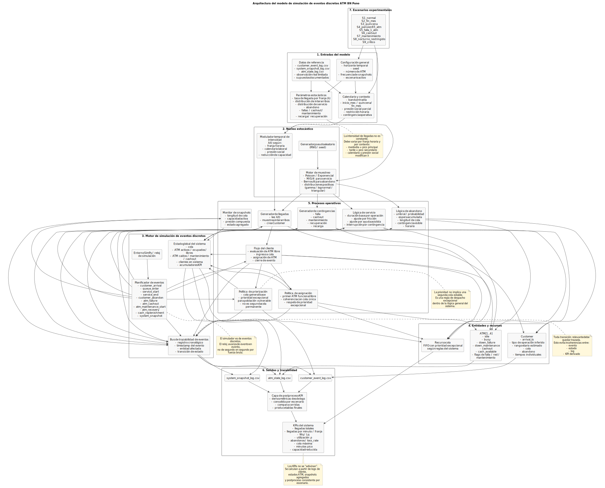

La versión fuente del diagrama se encuentra en `diagrams/atm_simulation_architecture.puml`.

### 16.12.9 Resumen estadístico del dataset sintético-realista de referencia

Con fines de preparación pre-simulación, se generó un dataset sintético-realista inicial alineado con la lógica del modelo. Este conjunto no reemplaza la validación empírica futura, pero sí permite:

- verificar coherencia estructural de variables y logs
- contrastar la lógica de picos por franja
- evaluar la interacción entre cola, espera, abandono y contingencias
- preparar la futura implementación computacional del simulador

#### a) Volumen de registros por día

| Fecha | Día | Registros de cliente |
|---|---|---:|
| `2026-05-04` | lunes | 633 |
| `2026-05-05` | martes | 717 |
| `2026-05-08` | viernes | 735 |

#### b) Distribución de registros por banda intradía

| Fecha | `morning_transition` | `midday_peak` | `afternoon_peak` | `evening_peak` | `night_low` |
|---|---:|---:|---:|---:|---:|
| `2026-05-04` | 101 | 258 | 96 | 112 | 66 |
| `2026-05-05` | 121 | 309 | 105 | 103 | 79 |
| `2026-05-08` | 98 | 273 | 111 | 125 | 128 |

Esta distribución es coherente con la hipótesis de pico principal en mediodía y presión secundaria en la tarde, con diferencias razonables entre lunes, martes y viernes.

#### c) Composición de operaciones inferidas

| Tipo de operación | Registros |
|---|---:|
| `retiro` | 1172 |
| `consulta` | 535 |
| `pago` | 201 |
| `transferencia` | 114 |
| `otros` | 63 |

La composición mantiene el predominio esperado de `retiro`, seguido de `consulta`, con menor presencia de `pago`, `transferencia` y `otros`.

#### d) Indicadores globales del conjunto sintético-realista

| Indicador | Valor |
|---|---:|
| Registros totales de cliente | 2085 |
| Clientes que encontraron cola | 947 |
| Clientes que abandonaron | 210 |
| Tiempo promedio de espera (`Wq` preliminar) | 59.51 s |
| Mediana de espera | 0.00 s |
| Espera máxima observada | 688.00 s |
| Tiempo promedio de servicio | 76.13 s |

La coexistencia de mediana de espera igual a cero con un promedio de espera positivo indica que una parte importante de los clientes accede al sistema sin demora, mientras que otra fracción experimenta episodios de congestión relevantes, especialmente en franjas pico o bajo contingencia operativa.

#### e) Lectura metodológica del conjunto generado

Este dataset debe interpretarse como una base experimental inicial para:

- validar la estructura de los logs del sistema
- probar coherencia entre eventos individuales, estados ATM y snapshots agregados
- observar el efecto combinado de picos, cola, abandono y reducción de capacidad
- servir como soporte inicial para calibración posterior y futura implementación en SimPy

No corresponde presentarlo como microdato empírico definitivo del comportamiento real de la sede. Su valor está en la consistencia estructural, en la plausibilidad operativa y en su utilidad para la construcción del simulador.

## 17. Diagramas incorporados en la documentación

El paquete diagramático principal forma parte de la presente documentación y cuenta, además, con versiones independientes en la carpeta `diagrams/`.

Estos diagramas no cumplen una función decorativa. Forman parte de la estructura explicativa del modelo y sirven para conectar:

- lógica operativa del sistema
- diseño de datos
- trazabilidad del evento de cliente
- representación de contingencias
- transición a implementación

### 17.1 Diagramas principales ya incorporados

#### a) BPMN-equivalente del proceso ATM
Representa:

- llegada del cliente
- registro observacional
- decisión de disponibilidad funcional
- formación de cola
- abandono
- asignación de ATM
- interrupciones por falla, cashout o mantenimiento
- cierre del evento y trazabilidad en datos

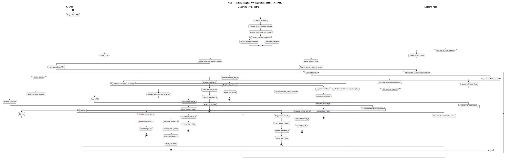

#### b) UML Activity Diagram
Representa ramas de decisión como:

- ATM libre / ocupado
- entra a cola / no entra
- espera / abandona
- operación exitosa / interrupción

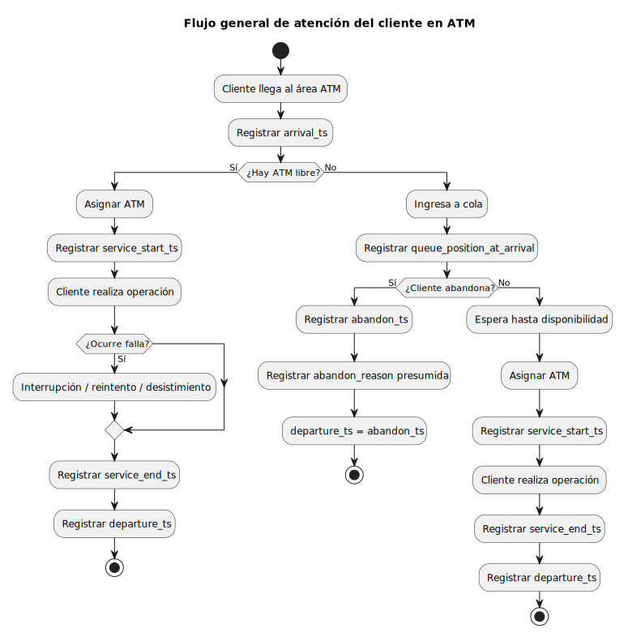

#### c) Estructura lógica de datos / entidad-relación simplificada
Documenta la relación entre:

- `customer_event_log.csv`
- `atm_state_log.csv`
- `system_snapshot_log.csv`

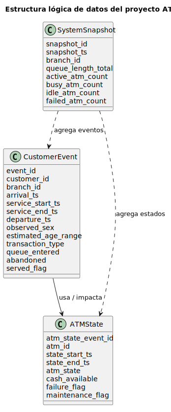

#### d) Diagrama de estados del ATM
Describe estados operativos como:

- `idle`
- `busy`
- `down_failure`
- `down_maintenance`
- `cashout`
- `offline`

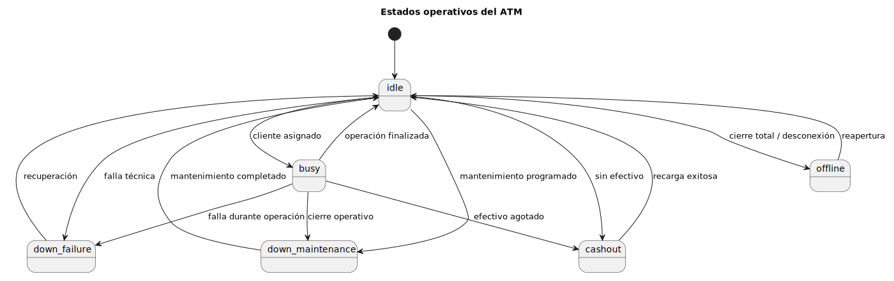

#### e) Casos de uso UML
Delimita alcance funcional del sistema observado/simulado y muestra relación entre cliente, observador, operación ATM y presión por programas sociales.

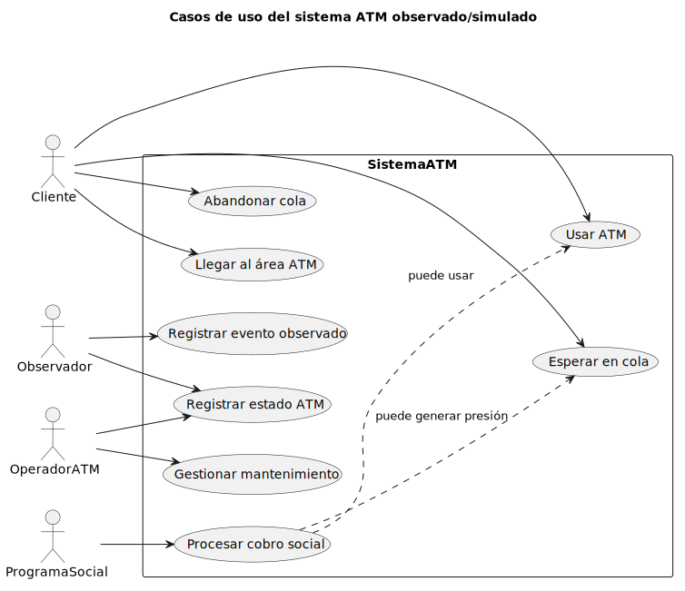

#### f) Mapa causal simplificado de congestión
Explica relaciones entre:

- calendario de pagos
- transferencias sociales
- hora del día
- capacidad operativa
- perfil del usuario
- tipo de operación
- cola
- abandono

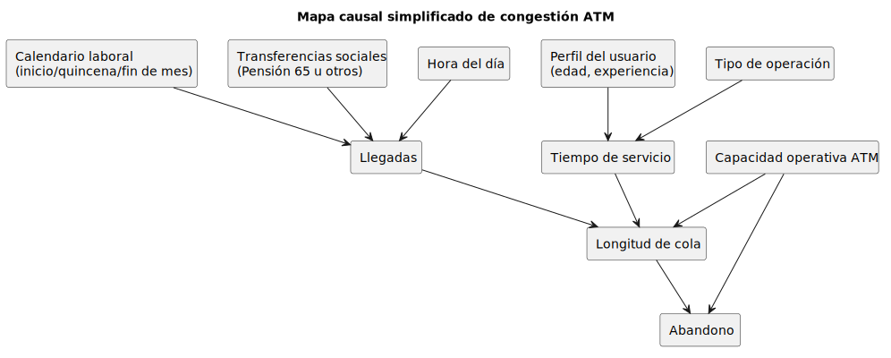

### 17.2 Función metodológica del paquete diagramático

Dentro del presente informe, los diagramas cumplen al menos cuatro funciones metodológicas:

1. **explicar el sistema observado** desde una perspectiva operacional
2. **alinear la estructura de datos** con la lógica del proceso
3. **hacer visibles las contingencias** que rompen la simplicidad de un modelo M/M/4 rígido
4. **preparar la transición a SimPy** con representaciones previas del flujo y de los estados del sistema

### 17.3 Relación con el Anexo D y con artefactos externos

El desarrollo completo de estos diagramas se encuentra en el **Anexo D**, donde aparecen:

- Activity Diagram
- State Diagram
- Use Case Diagram
- estructura lógica de datos
- mapa causal
- BPMN completo en texto estructurado
- BPMN-equivalente completo en PlantUML con lanes

Asimismo, las versiones fuente y renderizadas se encuentran en `diagrams/` como archivos:

- `.puml`
- `.png`
- `.svg`

Esto permite que el paquete diagramático cumpla una doble función:

- soporte explicativo dentro del informe
- soporte reutilizable para exposición, revisión e implementación futura

### 17.4 Priorización práctica de lectura y uso

Para una lectura rápida de la arquitectura del proyecto, el orden más útil es:

1. **BPMN-equivalente / flujo operacional completo**
2. **UML Activity Diagram**
3. **Estructura lógica de datos**
4. **Diagrama de estados del ATM**
5. **Mapa causal simplificado**
6. **Casos de uso UML**

Ese orden refleja adecuadamente la organización actual del informe, dado que los diagramas ya forman parte efectiva de la documentación técnica.

---

## 18. Cierre de la fase documental

La base conceptual y metodológica del documento se encuentra desarrollada para esta fase documental. No se identifican ausencias sustantivas internas que deban figurar como pendientes dentro de la presente especificación.

Los trabajos aún no incorporados corresponden a decisiones de implementación posterior del proyecto o a organización operativa de archivos, más que a carencias documentales del informe.

---

## 19. Convenciones de datos

- usar `snake_case`
- timestamps en formato `YYYY-MM-DD HH:MM:SS`
- booleanos en `true` / `false`
- categóricas en minúsculas con guion bajo
- no mezclar `12.49` con `12:49`
- no marcar como observado lo que fue inferido

---

## 20. Fuentes públicas consideradas en esta refinación

- **RENIEC**: padrón ERM 2026 y composición por sexo
- **INEI**: pobreza monetaria 2025 publicada en 2026; proyecciones de población 2018–2026
- **BCRP**: Reporte del Sistema Nacional de Pagos y tendencias de pagos digitales 2026
- **SBS**: marco y reportes de inclusión financiera

---

## 21. Conclusión metodológica

Este proyecto puede ser serio y defendible SI hace tres cosas bien:

1. diferencia entre dato observado, inferido y estimado
2. usa ejemplos realistas acordes al contexto de Puno en 2026
3. documenta explícitamente los supuestos antes de simular

Eso es lo que convierte una idea de aula en un trabajo con fundamento técnico real.

---

## Anexo A. Matriz de trazabilidad epistemológica

Este anexo define cómo se justifica cada componente del modelo. La idea no es solo “tener supuestos”, sino saber:

- de dónde sale cada afirmación
- cuán fuerte es su respaldo
- cuánto afecta los resultados
- cómo se validará o corregirá después

### A.1 Escala de nivel de evidencia

| Nivel | Descripción |
|---|---|
| `E1` | Observación directa del equipo en campo |
| `E2` | Evidencia documental pública oficial específica |
| `E3` | Inferencia razonable basada en contexto y literatura institucional |
| `E4` | Supuesto operativo provisional aún no validado |

### A.2 Escala de impacto en la simulación

| Nivel | Descripción |
|---|---|
| `alto` | puede cambiar fuertemente colas, tiempos o utilización |
| `medio` | afecta segmentación o realismo, pero no redefine el sistema |
| `bajo` | aporta detalle descriptivo, con poco efecto en KPIs principales |

### A.3 Escala de sensibilidad esperada

| Nivel | Descripción |
|---|---|
| `alta` | pequeñas variaciones alteran mucho el resultado |
| `media` | altera parcialmente métricas y patrones |
| `baja` | cambia poco el comportamiento agregado |

### A.4 Matriz principal de trazabilidad

| Variable / Regla | Origen de evidencia | Nivel evidencia | Tipo de construcción | Impacto | Sensibilidad | Plan de validación |
|---|---|---|---|---|---|---|
| sistema con 4 ATM | documento base del proyecto | E2 | supuesto_estructural | alto | alta | verificación en campo y con sede observada |
| llegada y salida de usuarios | observación externa | E1 | observado | alto | alta | ampliar muestreo por más días |
| longitud de cola visible | observación externa | E1 | observado | alto | alta | tomar snapshots sistemáticos por intervalo |
| tipo de operación no visible | restricción metodológica de observación externa | E1 | restricción_observacional | alto | alta | no tratar como observado; usar inferencia controlada |
| retiro como operación dominante | contexto ATM Perú 2026 + uso persistente de efectivo | E2/E3 | inferido | alto | alta | contrastar con observación de duraciones y patrón horario |
| consulta como operación corta | heurística operacional razonable | E3 | inferido | medio | media | validar contra duraciones muy breves repetidas |
| picos en mediodía y tarde | patrón urbano-laboral esperado + muestra observada | E1/E3 | inferido | alto | alta | observación extendida por franja |
| picos por inicio/fin de mes | lógica de pagos laborales y disponibilidad de fondos | E3 | supuesto_operativo | alto | alta | observar semanas 1 y 4/5 del mes |
| impacto bimestral de Pensión 65 | fuentes oficiales MIDIS/Pensión 65 | E2 | inferido | alto | media | observar fechas bimestrales de pago en zona |
| Pensión 65 cobra por ATM/agente y otras modalidades | fuentes oficiales MIDIS/Pensión 65 | E2 | hecho_operativo | alto | media | diferenciar localidad urbana vs alejada |
| mayoría de usuarios 18+ | contexto de uso ATM general + RENIEC adultez electoral | E2/E3 | inferido | medio | media | validar con nuevas observaciones |
| adolescentes como casos marginales | criterio contextual para ATM generalista | E3 | supuesto_operativo | medio | baja | corregir si el punto observado está cerca de campus/colegios |
| sexo/género cercano a paridad en adultos | padrón RENIEC 2026 | E2 | inferido | bajo | baja | usar solo como segmentación descriptiva |
| mayor dependencia del efectivo en Puno | INEI pobreza + heterogeneidad territorial + contexto financiero | E2/E3 | inferido | alto | media | contrastar con comportamiento de retiro y congestión |
| fallas y cashout como eventos discretos | documento base + realidad ATM | E2/E3 | supuesto_operativo | alto | media | observar interrupciones y saturación visibles |
| ventana restringida 22:00–05:00 | documento base | E2 | supuesto_operativo | medio | media | contrastar con política operativa real si se consigue |

### A.5 Lectura experta de la matriz

No todos los elementos deben recibir el mismo esfuerzo de validación.

#### Prioridad 1 de validación
Son los que más cambian los KPIs:

- patrón de llegadas
- definición de picos
- mezcla de tipos de operación
- impacto de pagos laborales
- impacto de Pensión 65
- abandono por saturación

#### Prioridad 2 de validación

- comportamiento por franja etaria
- diferencias por sexo/género percibido
- distribución de fallas

#### Prioridad 3 de validación

- refinamientos descriptivos de perfil de usuario

### A.6 Regla metodológica de uso

Cada vez que se agregue una nueva variable o regla al modelo, debe incorporarse a esta matriz. Si no entra en la matriz, no debería entrar a la simulación.

---

## Anexo C. Taxonomía exacta de peak flags y calendario operativo

El objetivo de este anexo es reemplazar el `peak_flag` genérico por un sistema reproducible y auditable.

### C.1 Principio general

Un “pico” no es una sensación del observador. Debe ser una condición definida por calendario, franja horaria o evento social/operativo.

Por eso se recomienda separar los picos en múltiples dimensiones.

### C.2 Peak flags recomendados

#### 1. `peak_intraday_flag`
Marca si una observación ocurre en una franja horaria de alta congestión intradía.

Valores:
- `true`
- `false`

#### 2. `peak_intraday_band`
Clasifica la franja del día.

Valores recomendados:
- `morning_low`
- `morning_transition`
- `midday_peak`
- `afternoon_peak`
- `evening_peak`
- `night_low`

#### 3. `peak_payroll_flag`
Marca si el registro cae dentro de un periodo de presión por pagos laborales.

Valores:
- `true`
- `false`

#### 4. `payroll_cycle_type`
Clasifica el tipo de presión de calendario laboral.

Valores:
- `inicio_mes`
- `quincena`
- `fin_mes`
- `ninguno`

#### 5. `peak_social_transfer_flag`
Marca presión por programas sociales.

Valores:
- `true`
- `false`

#### 6. `social_transfer_program`
Identifica el programa social asociado si existe.

Valores iniciales:
- `pension_65`
- `otro`
- `ninguno`

#### 7. `social_transfer_access_channel`
Canal probable de cobro del programa social.

Valores:
- `atm_agente`
- `agencia`
- `etv`
- `domicilio`
- `desconocido`

#### 8. `peak_operational_flag`
Marca si la congestión está agravada por reducción de capacidad operativa.

Valores:
- `true`
- `false`

#### 9. `peak_operational_type`
Describe la causa operativa.

Valores:
- `atm_failure`
- `cashout`
- `maintenance`
- `network_issue`
- `reduced_service_window`
- `none`

#### 10. `peak_composite_level`
Resume el nivel de presión total del sistema combinando dimensiones.

Valores:
- `normal`
- `moderado`
- `alto`
- `critico`

### C.3 Regla operativa de calendario laboral

Mientras no se tenga calendario bancario oficial detallado de la sede, se propone la siguiente regla documental inicial:

#### `inicio_mes`
- del día 1 al día 5 del mes

#### `quincena`
- del día 14 al día 16 del mes

#### `fin_mes`
- del día 28 al último día del mes

#### `ninguno`
- cualquier otro día

Esto NO es una verdad universal, sino una regla operativa inicial defendible para observación y simulación.

### C.4 Regla operativa de Pensión 65

Con base en la evidencia pública, se debe documentar que:

- Pensión 65 genera presión **bimestral**
- no toda esa presión llega al ATM observado
- el efecto depende del canal de cobro disponible en la zona

Por eso la regla correcta es:

- activar `peak_social_transfer_flag = true` en periodos bimestrales identificados
- pero diferenciar el impacto esperado según `social_transfer_access_channel`

### C.5 Regla de combinación para `peak_composite_level`

Se propone esta lógica inicial:

#### `normal`
- sin pico intradía
- sin pico laboral
- sin transferencia social
- sin reducción operativa

#### `moderado`
- una sola fuente de presión activa

#### `alto`
- dos fuentes de presión activas

#### `critico`
- tres o más fuentes de presión activas
- o una presión alta combinada con reducción operativa fuerte

Ejemplo:

- mediodía + fin de mes = `alto`
- mediodía + fin de mes + falla de ATM = `critico`

### C.6 Tabla maestra de interpretación

| Dimensión | Variable | Uso |
|---|---|---|
| hora del día | `peak_intraday_flag`, `peak_intraday_band` | capturar congestión por franja |
| calendario laboral | `peak_payroll_flag`, `payroll_cycle_type` | capturar efecto salarios/pagos |
| programas sociales | `peak_social_transfer_flag`, `social_transfer_program`, `social_transfer_access_channel` | capturar presión bimestral o focalizada |
| operación del sistema | `peak_operational_flag`, `peak_operational_type` | capturar pérdida de capacidad |
| síntesis | `peak_composite_level` | resumir estado general |

### C.7 Recomendación de actualización de CSVs

En la siguiente iteración, el dataset de eventos y snapshots debería incorporar estas nuevas variables. El actual `peak_flag` puede mantenerse por compatibilidad, pero debería convertirse en una derivación simplificada de esta taxonomía.

### C.8 Regla de especialista

Nunca usar un único `peak_flag` como si explicara toda la congestión. En sistemas reales de ATM, la congestión es multicausal:

- hora
- calendario
- transferencias sociales
- capacidad operativa
- perfil de usuario

Y si no se separan esas causas, después no se entiende por qué hubo cola.

---

## Anexo B. Diccionario formal de datos

Este anexo define de manera operativa cada variable del modelo. El objetivo es evitar ambigüedades y garantizar consistencia entre observación, documentación, limpieza y simulación.

---

### B.1 Diccionario de `customer_event_log.csv`

| Variable | Nombre legible | Tipo | Dominio / formato | Nulos | Origen | Definición operacional | Regla de consistencia |
|---|---|---|---|---|---|---|---|
| `event_id` | ID del evento | string | `EVT-XXXX` | No | observado | identificador único del evento de cliente | no repetir |
| `customer_id` | ID anónimo del cliente | string | `CUST-XXXX` | No | observado | identificador no personal del usuario observado | no repetir por evento |
| `branch_id` | sede | string | texto controlado | No | observado | identifica la sede o punto ATM | debe coincidir con catálogo de sedes |
| `observation_date` | fecha de observación | date | `YYYY-MM-DD` | No | observado | fecha calendario del evento | debe coincidir con `arrival_ts` |
| `day_of_week` | día de semana | categorical | monday...sunday | No | derivado | día de la semana derivado de la fecha | debe derivarse automáticamente |
| `day_type` | tipo de día | categorical | `weekday`, `saturday`, `sunday_holiday` | No | derivado | clasifica el día según patrón operativo | coherente con `day_of_week` |
| `hour_block` | bloque horario | string | `HH:MM-HH:MM` | No | derivado | bloque horario normalizado del evento | debe contener `arrival_ts` |
| `peak_flag` | pico simplificado | boolean | `true`, `false` | No | inferido | bandera resumida de congestión | idealmente derivada de taxonomía C |
| `peak_intraday_band` | banda intradía | categorical | `morning_low`, `morning_transition`, `midday_peak`, `afternoon_peak`, `evening_peak`, `night_low` | No | inferido | franja operativa intradía del evento | coherente con `arrival_ts` |
| `payroll_cycle_type` | ciclo de pagos laborales | categorical | `inicio_mes`, `quincena`, `fin_mes`, `ninguno` | No | inferido | clasifica presión de calendario laboral | coherente con `observation_date` |
| `peak_social_transfer_flag` | presión de transferencia social | boolean | `true`, `false` | No | inferido | indica si el evento cae en contexto de programa social relevante | requiere criterio de calendario |
| `peak_operational_type` | tipo de presión operativa | categorical | `atm_failure`, `cashout`, `maintenance`, `network_issue`, `reduced_service_window`, `none` | No | inferido/modelado | causa operativa dominante que agrava la congestión | coherente con estado ATM o snapshot |
| `peak_composite_level` | nivel compuesto de presión | categorical | `normal`, `moderado`, `alto`, `critico` | No | inferido | síntesis multicausal de presión del sistema | coherente con combinación de flags |
| `arrival_ts` | llegada | datetime | `YYYY-MM-DD HH:MM:SS` | No | observado | instante de llegada visible del usuario al sistema | debe ser <= `departure_ts` |
| `service_start_ts` | inicio de atención | datetime | `YYYY-MM-DD HH:MM:SS` | Sí | inferido | instante aproximado en que inicia uso efectivo del ATM | si existe, debe ser >= `arrival_ts` |
| `service_end_ts` | fin de atención | datetime | `YYYY-MM-DD HH:MM:SS` | Sí | inferido | instante aproximado en que termina la operación | si existe, debe ser >= `service_start_ts` |
| `departure_ts` | salida | datetime | `YYYY-MM-DD HH:MM:SS` | No | observado/inferido | instante en que abandona el área observable o concluye interacción | debe ser >= `arrival_ts` |
| `observed_sex` | sexo/género percibido | categorical | `masculino`, `femenino`, `no_determinado` | Sí | observado_visual | percepción visual externa del observador | nunca tratar como identidad verificada |
| `estimated_age_range` | rango etario estimado | categorical | `joven`, `adulto`, `adulto_mayor`, `adolescente`, `no_determinado` | Sí | inferido | rango etario aproximado visible | evitar `adolescente` salvo caso claro |
| `estimated_age_min` | edad mínima estimada | integer | entero | Sí | inferido | extremo inferior del rango etario asignado | coherente con `estimated_age_range` |
| `estimated_age_max` | edad máxima estimada | integer | entero | Sí | inferido | extremo superior del rango etario asignado | >= `estimated_age_min` |
| `transaction_type` | tipo de operación | categorical | `retiro`, `consulta`, `pago`, `transferencia`, `otros` | Sí | inferido | tipo de operación presumido por duración y comportamiento visible | nunca marcar como observado directo |
| `transaction_type_inferred` | operación inferida | boolean | `true`, `false` | No | inferido | indica si el tipo fue inferido | para observación externa casi siempre `true` |
| `transaction_type_confidence` | confianza de inferencia | categorical | `baja`, `media`, `alta` | Sí | inferido | grado de confianza de la inferencia del tipo | no usar `alta` sin criterio fuerte |
| `atm_id` | ATM utilizado | integer | 1..n | Sí | inferido | cajero asignado o presumido | coherente con estado ATM si existe |
| `queue_entered` | ingresó a cola | boolean | `true`, `false` | No | observado | si el usuario tuvo que esperar | si `false`, posición debe ser 0 o nula |
| `queue_position_at_arrival` | posición en cola | integer | 0..n | Sí | observado/inferido | posición aproximada al llegar | si `queue_entered=false`, debe ser 0 |
| `abandoned` | abandonó | boolean | `true`, `false` | No | observado | si el usuario dejó la cola sin atención | si `true`, `served_flag=false` |
| `abandon_ts` | momento de abandono | datetime | `YYYY-MM-DD HH:MM:SS` | Sí | observado/inferido | instante en que desiste y se retira | requerido si `abandoned=true` |
| `abandon_reason` | causa de abandono presumida | categorical | `saturacion`, `espera_alta`, `falla_percibida`, `horario`, `otros` | Sí | inferido | causa probable del abandono | no tratar como causa verificada |
| `served_flag` | fue atendido | boolean | `true`, `false` | No | inferido | indica si logró usar ATM | incompatible con abandono final |
| `blocked_by_closed_hours` | bloqueado por ventana restringida | boolean | `true`, `false` | No | estimado/modelado | marca afectación por restricción operativa horaria | usar solo en escenarios pertinentes |
| `observation_mode` | modo de observación | categorical | `externa_visual` | No | observado | método de captura de datos | fijo para esta etapa |
| `data_quality_flag` | calidad/origen sintético | categorical | `observado`, `inferido`, `estimado`, `mixto` | No | metadato | resume naturaleza dominante del registro | debe ser coherente con columnas llenadas |

---

### B.2 Diccionario de `atm_state_log.csv`

| Variable | Nombre legible | Tipo | Dominio / formato | Nulos | Origen | Definición operacional | Regla de consistencia |
|---|---|---|---|---|---|---|---|
| `atm_state_event_id` | ID del estado ATM | string | `ATMSTATE-XXXX` | No | observado/modelado | identificador único del cambio de estado | no repetir |
| `atm_id` | ATM | integer | 1..n | No | observado/modelado | identificador del cajero | debe existir en catálogo lógico del sistema |
| `state_start_ts` | inicio de estado | datetime | `YYYY-MM-DD HH:MM:SS` | No | observado/inferido | momento de inicio del estado | < `state_end_ts` si existe |
| `state_end_ts` | fin de estado | datetime | `YYYY-MM-DD HH:MM:SS` | Sí | observado/inferido | momento de cierre del estado | >= `state_start_ts` |
| `atm_state` | estado ATM | categorical | `idle`, `busy`, `down_failure`, `down_maintenance`, `cashout`, `offline` | No | inferido/modelado | estado operativo del ATM | debe coincidir con flags auxiliares |
| `cash_available` | efectivo disponible | numeric | número >= 0 | Sí | estimado/modelado | efectivo remanente estimado | 0 si `cashout` |
| `failure_flag` | falla técnica | boolean | `true`, `false` | No | inferido/modelado | indica falla técnica | si `true`, estado coherente con falla |
| `failure_type` | tipo de falla | categorical | `red`, `hardware`, `software`, `falta_efectivo`, `otros` | Sí | estimado/modelado | clase de falla presumida/modelada | si `failure_flag=false`, idealmente nulo |
| `maintenance_flag` | mantenimiento | boolean | `true`, `false` | No | estimado/modelado | indica intervención operativa | si `true`, estado coherente |
| `maintenance_type` | tipo de mantenimiento | categorical | `preventivo`, `correctivo`, `recarga_efectivo`, `reinicio` | Sí | estimado/modelado | clase de mantenimiento | nulo si no aplica |
| `network_outage_flag` | caída de red | boolean | `true`, `false` | No | estimado/modelado | indica problema externo de conectividad | coherente con `failure_type=red` si aplica |
| `data_quality_flag` | calidad del registro | categorical | `observado`, `inferido`, `estimado`, `mixto` | No | metadato | resume naturaleza del registro | coherente con construcción del estado |

---

### B.3 Diccionario de `system_snapshot_log.csv`

| Variable | Nombre legible | Tipo | Dominio / formato | Nulos | Origen | Definición operacional | Regla de consistencia |
|---|---|---|---|---|---|---|---|
| `snapshot_id` | ID del snapshot | string | `SNAP-XXXX` | No | observado/modelado | identificador único del snapshot | no repetir |
| `snapshot_ts` | instante snapshot | datetime | `YYYY-MM-DD HH:MM:SS` | No | observado/modelado | instante de medición agregada | debe corresponder a franja válida |
| `branch_id` | sede | string | texto controlado | No | observado | sede del sistema observado | consistente con eventos |
| `hour_block` | bloque horario | string | `HH:MM-HH:MM` | No | derivado | bloque horario del snapshot | debe contener `snapshot_ts` |
| `peak_flag` | pico simplificado | boolean | `true`, `false` | No | inferido | bandera resumida | idealmente derivada del anexo C |
| `peak_intraday_band` | banda intradía | categorical | `morning_low`, `morning_transition`, `midday_peak`, `afternoon_peak`, `evening_peak`, `night_low` | No | inferido | franja intradía del snapshot | coherente con `snapshot_ts` |
| `payroll_cycle_type` | ciclo de pagos laborales | categorical | `inicio_mes`, `quincena`, `fin_mes`, `ninguno` | No | inferido | contexto de calendario laboral | coherente con fecha |
| `peak_social_transfer_flag` | presión social | boolean | `true`, `false` | No | inferido | indica presión por programa social | requiere criterio temporal |
| `peak_operational_type` | presión operativa dominante | categorical | `atm_failure`, `cashout`, `maintenance`, `network_issue`, `reduced_service_window`, `none` | No | inferido/modelado | causa operativa dominante del estado agregado | coherente con conteos ATM |
| `peak_composite_level` | presión compuesta | categorical | `normal`, `moderado`, `alto`, `critico` | No | inferido | síntesis de presión global del sistema | derivable de múltiples factores |
| `restricted_cash_window_flag` | ventana restringida | boolean | `true`, `false` | No | modelado | marca la franja 22:00–05:00 o equivalente | coherente con hora |
| `queue_length_total` | longitud total de cola | integer | 0..n | No | observado/inferido | personas esperando en el instante | no puede ser negativo |
| `active_atm_count` | ATM activos | integer | 0..n | No | inferido/modelado | número de ATM operables | <= total ATM |
| `busy_atm_count` | ATM ocupados | integer | 0..n | No | inferido/modelado | ATM en servicio activo | <= `active_atm_count` |
| `idle_atm_count` | ATM libres | integer | 0..n | No | inferido/modelado | ATM operables sin uso | coherente con conteos |
| `failed_atm_count` | ATM fallidos | integer | 0..n | No | estimado/modelado | ATM fuera por falla | no puede ser negativo |
| `cashout_atm_count` | ATM sin efectivo | integer | 0..n | No | estimado/modelado | ATM sin efectivo disponible | no puede ser negativo |
| `blocked_arrivals_count` | llegadas bloqueadas | integer | 0..n | No | modelado | llegadas no atendibles por restricción o capacidad | no puede ser negativo |
| `data_quality_flag` | calidad del snapshot | categorical | `observado`, `inferido`, `estimado`, `mixto` | No | metadato | resume naturaleza del snapshot | coherente con origen de cifras |

---

### B.4 Variables recomendadas para futura iteración

Las siguientes variables siguen siendo recomendadas para una versión aún más rica del modelo:

| Variable | Archivo sugerido | Justificación |
|---|---|---|
| `peak_intraday_flag` | customer/system | separar pico horario real |
| `peak_payroll_flag` | customer/system | capturar explícitamente efecto de pagos laborales |
| `social_transfer_program` | customer/system | distinguir Pensión 65 u otros |
| `social_transfer_access_channel` | customer/system | distinguir ATM/agente, agencia, ETV, domicilio |
| `peak_operational_flag` | system | separar presión causada por pérdida de capacidad |
| `assisted_service_flag` | customer | marcar intervención del personal |
| `priority_queue_flag` | customer | distinguir eventos de cola preferencial |

---

### B.5 Reglas generales de consistencia cruzada

1. Si `abandoned=true`, entonces `served_flag` debe ser `false`.
2. Si `queue_entered=false`, la posición en cola debe ser `0` o nula.
3. Si existe `service_end_ts`, debe existir `service_start_ts`.
4. `departure_ts` nunca puede ser anterior a `arrival_ts`.
5. Si `atm_state=cashout`, entonces `cash_available` debería ser `0` o casi `0`.
6. `busy_atm_count + idle_atm_count` no debería exceder `active_atm_count`.
7. Ningún conteo agregado del sistema puede ser negativo.
8. Variables inferidas no deben etiquetarse como observadas.

---

## Anexo D. Diagramas del sistema en PlantUML

Este anexo entrega diagramas textuales en PlantUML para que puedan renderizarse luego en herramientas compatibles.

---

### D.1 Activity Diagram — flujo general del cliente en ATM

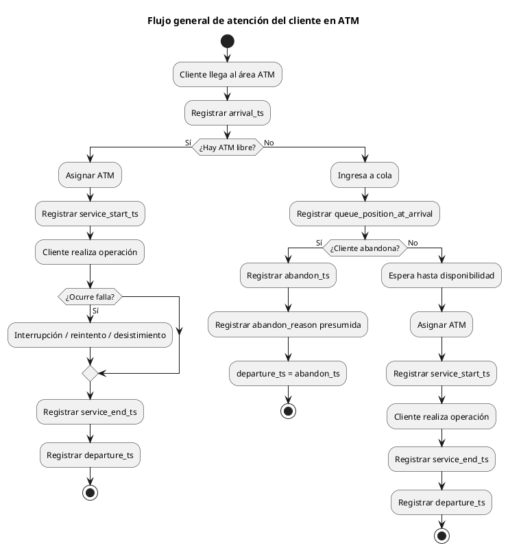

**Diagrama renderizado:**

---

### D.2 State Diagram — estados del ATM

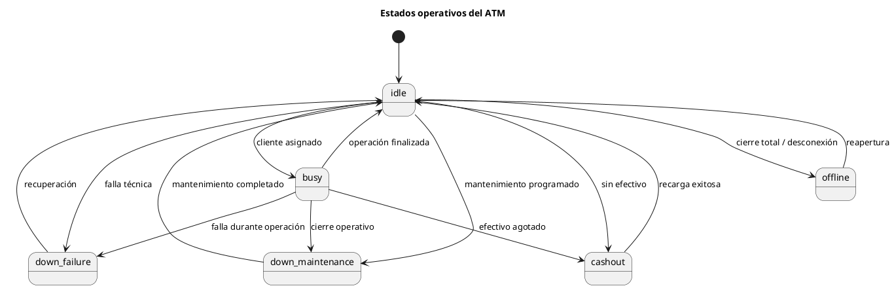

**Diagrama renderizado:**

---

### D.3 Use Case Diagram — alcance funcional del sistema observado/simulado

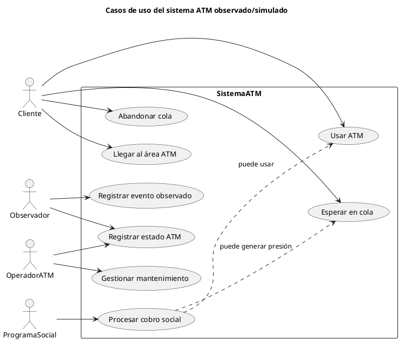

**Diagrama renderizado:**

---

### D.4 Diagrama de clases / estructura lógica de datos

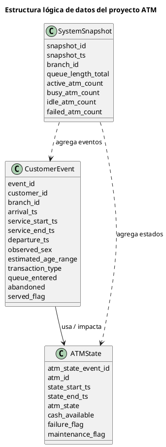

**Diagrama renderizado:**

---

### D.5 Mapa causal simplificado de congestión

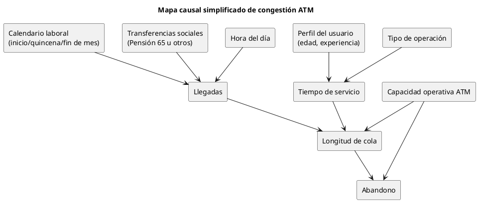

**Diagrama renderizado:**

---

### D.6 BPMN completo para futura diagramación

Acá ya NO conviene una versión resumida. Para este proyecto, el flujo debe representar de forma completa:

- la llegada del cliente
- el registro observacional
- la decisión de capacidad disponible
- la formación de cola
- el posible abandono
- la asignación de ATM
- la ejecución de la operación
- las interrupciones por falla, cashout o mantenimiento
- el tratamiento especial de restricciones horarias
- el cierre del evento y su trazabilidad en los datos

### D.6.1 Participantes / lanes recomendados en BPMN

Para que el diagrama sea serio, se recomienda usar al menos estas lanes:

1. **Cliente**
2. **Observador / Sistema de registro**
3. **Sistema ATM**
4. **Operación / Gestión ATM**

Opcionalmente, una quinta lane:

5. **Contexto operativo externo**
   - calendario de pagos
   - transferencias sociales
   - ventana restringida

### D.6.2 Flujo BPMN completo en texto estructurado

#### Evento de inicio
1. **Inicio del evento de cliente**

#### Lane Cliente
2. Cliente llega al área ATM.
3. Cliente observa disponibilidad aparente del sistema.

#### Lane Observador / Registro
4. Observador registra:
   - `arrival_ts`
   - fecha
   - franja horaria
   - longitud visible de cola
   - perfil visual del usuario si es posible

#### Gateway 1: ¿la observación ocurre en ventana operativa restringida?
5. Evaluar si el evento cae en franja con restricción de servicio o disponibilidad.
   - Si **sí**: marcar contexto restringido.
   - Si **no**: continuar flujo normal.

#### Gateway 2: ¿hay ATM disponible de forma aparente?
6. Sistema/observador determina si existe ATM libre y utilizable.
   - Si **sí**: pasar a asignación directa.
   - Si **no**: pasar a cola.

#### Rama A: atención directa
7. Cliente accede a ATM.
8. Observador registra inicio aproximado de atención (`service_start_ts`, inferido).

#### Gateway 3A: ¿el ATM permanece operativo?
9. Durante la operación, evaluar si ocurre:
   - falla técnica
   - falta de efectivo
   - mantenimiento / reinicio
   - interrupción de red

10. Si **no ocurre interrupción**:
   - cliente continúa operación
   - observador registra fin aproximado (`service_end_ts`)
   - observador registra salida (`departure_ts`)
   - clasificar si fue atendido (`served_flag = true`)
   - finalizar evento

11. Si **ocurre interrupción**:
   - cliente puede esperar, reintentar o desistir

#### Gateway 4A: ¿cliente reintenta o abandona tras interrupción?
12. Si **reintenta**:
   - volver a evaluación de operatividad o disponibilidad
13. Si **abandona**:
   - registrar `abandon_ts`
   - inferir `abandon_reason`
   - registrar `departure_ts`
   - `served_flag = false`
   - finalizar evento

#### Rama B: ingreso a cola
14. Cliente entra a cola.
15. Observador registra:
   - `queue_entered = true`
   - `queue_position_at_arrival`
   - longitud visible de cola

#### Gateway 3B: ¿la espera supera la tolerancia del cliente?
16. Mientras espera, pueden ocurrir simultáneamente:
   - avance normal de cola
   - aumento de congestión
   - falla de ATM
   - reducción de capacidad
   - desistimiento por espera

#### Gateway 4B: ¿cliente abandona antes de ser atendido?
17. Si **sí abandona**:
   - registrar `abandon_ts`
   - inferir causa probable (`saturacion`, `espera_alta`, `horario`, `falla_percibida`, etc.)
   - registrar `departure_ts`
   - `served_flag = false`
   - finalizar evento

18. Si **no abandona**:
   - esperar disponibilidad de ATM

#### Gateway 5B: ¿se libera un ATM funcional?
19. Si **sí**:
   - asignar ATM
   - registrar `service_start_ts`
   - pasar a ejecución de operación
20. Si **no**:
   - continuar espera o reevaluar abandono

#### Ejecución tras cola
21. Cliente usa ATM.

#### Gateway 6B: ¿ocurre interrupción durante operación?
22. Si **no**:
   - registrar `service_end_ts`
   - registrar `departure_ts`
   - `served_flag = true`
   - finalizar evento

23. Si **sí**:
   - cliente espera, reintenta o desiste

#### Gateway 7B: ¿reintenta o abandona?
24. Si **reintenta**:
   - volver a evaluación de disponibilidad funcional
25. Si **abandona**:
   - registrar abandono y salida
   - `served_flag = false`
   - finalizar evento

#### Lane Operación / Gestión ATM
26. En paralelo, el sistema ATM puede pasar por estados:
   - `idle`
   - `busy`
   - `down_failure`
   - `down_maintenance`
   - `cashout`
   - `offline`

27. Todo cambio relevante de estado debe reflejarse en `atm_state_log.csv`.

#### Lane Observador / Registro — cierre del evento
28. Al finalizar cada evento, consolidar:
   - tiempos
   - condición de servicio o pérdida
   - clasificación de cola
   - variables inferidas
   - `data_quality_flag`

#### Evento de fin
29. **Fin del evento de cliente**

### D.6.3 Notas técnicas de modelado BPMN

Este BPMN completo debe reflejar que el sistema NO depende solo de “ATM libre / ATM ocupado”. También depende de:

- operatividad real del cajero
- tolerancia del usuario a la espera
- restricción horaria
- presión por calendario de pagos
- presión por transferencias sociales
- reducción de capacidad efectiva del sistema

Si el BPMN no muestra esas causas, el diagrama queda demasiado académico y poco realista.

### D.6.4 Representación PlantUML completa del flujo BPMN-equivalente

PlantUML no implementa BPMN nativo de forma estándar como una suite BPMN dedicada, pero sí permite representar el flujo completo con un **Activity Diagram con particiones (lanes)**, que en este proyecto funciona como equivalente operativo muy sólido.

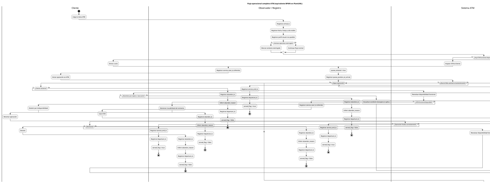

**Diagrama renderizado:**

### D.6.5 Recomendación de especialista para este diagrama

Cuando lo rendericen, no lo vendan como “dibujito del flujo”. Preséntenlo como:

**modelo operacional del evento de cliente bajo restricciones observacionales y contingencias operativas del sistema ATM**.

Eso cambia totalmente el nivel del informe.

---

### D.7 Recomendación práctica para el equipo

Si tienen que priorizar qué renderizar primero, hagan esto:

1. `D.1 Activity Diagram`
2. `D.4 Estructura lógica de datos`
3. `D.2 State Diagram`
4. `D.5 Mapa causal`

Eso les da una base visual muy sólida para informe, exposición y futura implementación.
